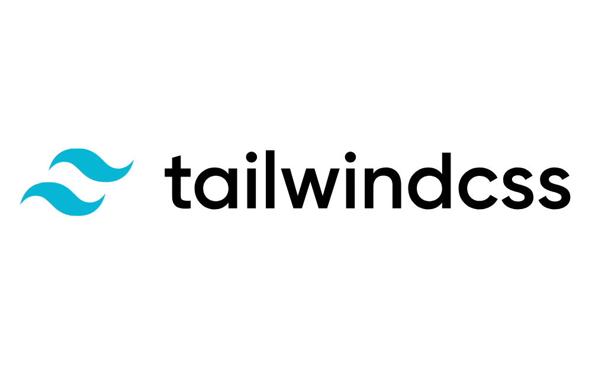

## はじめに

つい最近 Gatsby.js + Tailwind CSS + Gatsby Cloud の構成で当ブログを作成しました。  
このような構成にした理由としては、私は本業で Web 制作をしておりその延長で技術的にスキルアップしたいと模索していたところ、Gatsby.js がとても魅力的に感じたのが経緯です。

この記事では当ブログを作成していく最中工夫した点や、これから個人ブログを作ろうと思っている方に向けて、使用している各技術の概要・参考リンク等をまとめましたので、記事を読みに来てくれた方の参考になれば幸いです。

## 使用技術とサービス

この章では、当ブログを作成する際に使用した技術を紹介していきます。

**フレームワーク**


> The hardest parts of the web, made simple.  
> Gatsby is unbelievably fast & smooth.  
> Everything just feels...there.

> Web の最も難しい部分をシンプルにしました。  
> Gatsby は信じられないほど速く、スムーズです。  
> すべてが「そこにある」という感じです。
> <cite>[Gatsby.js](https://www.gatsbyjs.com/)公式より一部引用</cite>

<div class="iframely-embed"><div class="iframely-responsive" style="height: 140px; padding-bottom: 0;"><a href="https://www.gatsbyjs.com/" data-iframely-url="//cdn.iframe.ly/api/iframe?url=https%3A%2F%2Fwww.gatsbyjs.com%2F&amp;key=d4798a05d91c041893af4b71314755fa"></a></div></div>

Gatsby.js は、JavaScript のライブラリである React をベースに作成されています。  
魅力としては、Gatsby.js で作成したサイトは SPA（Single Page Application） で生成される為、内部リンクのページ遷移が非常に高速であり、公式よりスターターテンプレート（10 分程度で Web サイトやブログが作れるテンプレート）や、豊富なプラグイン（拡張機能）が用意されている点です。

<div class="iframely-embed mb-4"><div class="iframely-responsive" style="height: 140px; padding-bottom: 0;"><a href="https://www.gatsbyjs.com/starters/" data-iframely-url="//cdn.iframe.ly/api/iframe?url=https%3A%2F%2Fwww.gatsbyjs.com%2Fstarters%2F%3F&amp;key=d4798a05d91c041893af4b71314755fa"></a></div></div>

<div class="iframely-embed"><div class="iframely-responsive" style="height: 140px; padding-bottom: 0;"><a href="https://www.gatsbyjs.com/plugins" data-iframely-url="//cdn.iframe.ly/api/iframe?url=https%3A%2F%2Fwww.gatsbyjs.com%2Fplugins&amp;key=d4798a05d91c041893af4b71314755fa"></a></div></div>

スターターテンプレートを使用し、一瞬で自分のブログを作成する事もできれば、実装したい機能に応じてプラグインを導入することで難しい事を殆ど考えず、機能を追加する事が出来ます。  
当ブログで実際に使用しているプラグインや、機能用途に応じたおすすめのプラグインに関しては、今後別の記事で紹介したいと思います。



[Tailwind CSS](https://tailwindcss.com/) とは、ユーティリティーファーストの CSS フレームワークです。

<div class="iframely-embed"><div class="iframely-responsive" style="height: 140px; padding-bottom: 0;"><a href="https://tailwindcss.com/" data-iframely-url="//cdn.iframe.ly/api/iframe?url=https%3A%2F%2Ftailwindcss.com%2F&amp;key=d4798a05d91c041893af4b71314755fa"></a></div></div>

簡単な使用例と、そのクラスに当たるスタイルの詳細を記載します。

```jsx:title=TailwindCSSの使用例
<p className="font-bold text-center">Hello!<span class="text-blue-500 pl-1">Tailwind CSS</span></p>
```

実際の表示

<p class="font-bold text-center">Hello!<span class="text-blue-500 pl-1">Tailwind CSS</span></p>

| Tailwind CSS |     `font-bold`      |     `text-center`     |  `text-blue-500`  |        `pl-1`        |
| :----------: | :------------------: | :-------------------: | :---------------: | :------------------: |
|   Pure CSS   | `font-weight: bold;` | `text-align: center;` | `color: #3B82F6;` | `padding-left: 4px;` |

上記の例のように、予め Tailwind CSS で用意されている最小単位のクラス名を自分で組み合わせて UI を構築していく仕組みです。

Tailwind CSS に興味がある方は、[Tailwind CSS を使用する際に知ってると便利な参考サイト集](../tailwind-css-reference-resource) も別の記事で書いてますので、チェックしてみてください。

**SVG アイコン**

- [heroicons](https://heroicons.com/)

<div class="iframely-embed"><div class="iframely-responsive" style="height: 140px; padding-bottom: 0;"><a href="https://heroicons.com" data-iframely-url="//cdn.iframe.ly/api/iframe?url=https%3A%2F%2Fheroicons.com%2F&amp;key=d4798a05d91c041893af4b71314755fa"></a></div></div>

Tailwind CSS（のグループ？） が作成している SVG アイコンで、使用する全てのアイコンは 2 種類（枠線のみ・塗り潰し）から自由に選ぶ事ができ、見た目・使い勝手の良さからこちらをメインで使用する事にしました。

```jsx:title=heroiconsの使用例
/**
  塗り潰しのアイコンは末尾がsolid
	import { HashtagIcon } from "@heroicons/react/solid";
*/

import { HashtagIcon } from "@heroicons/react/outline"; // 枠線アイコン

const TagIcon = () => {
	return (
		<div>
			<HashtagIcon className="h-4 w-4 inline-block text-blue-500" />
		</div>
	);
};

export default TagIcon
```

**ホスティング**

- [Gatsby Cloud](https://www.gatsbyjs.com/products/cloud/)

<div class="iframely-embed"><div class="iframely-responsive" style="height: 140px; padding-bottom: 0;"><a href="https://www.gatsbyjs.com/products/cloud/" data-iframely-url="//cdn.iframe.ly/api/iframe?url=https%3A%2F%2Fwww.gatsbyjs.com%2Fproducts%2Fcloud%2F&amp;key=d4798a05d91c041893af4b71314755fa"></a></div></div>

これまでビルド機能をメインにサービスを提供していた [Gatsby Cloud](https://www.gatsbyjs.com/products/cloud/) ですが、2021 年 3 月 3 日に [ホスティング機能をリリース](https://www.gatsbyjs.com/blog/gatsby-cloud-hosting-pricing-plan) したようです。

デプロイ後に Gatsby Cloud のダッシュボードにて、Lighthouse のスコアが自動で計測され表示されるので極端にスコアが低い場合の異変等に気付きやすい点が気に入っています。


Gatsby Cloud の魅力は [incremental builds](https://www.gatsbyjs.com/blog/2020-04-22-announcing-incremental-builds/) という機能で有料になりますが、変更ファイルの差分のみビルドを行うので、ビルド時間が大幅に削減できます。

---

<p class="notice">追記：）Cloudflare Pages に移行しました</p>

Gatsby Cloud から静的サイトのホスティングサービス、Cloudflare Pages に移行しました。

この件に関しては、今後別の記事で紹介しようと思います。  
静的サイトのホスティング先としておすすめなので、気になる方はチェックしてみてください。

<div class="iframely-embed"><div class="iframely-responsive" style="height: 140px; padding-bottom: 0;"><a href="https://pages.cloudflare.com/" data-iframely-url="//cdn.iframe.ly/api/iframe?url=https%3A%2F%2Fpages.cloudflare.com%2F&amp;key=d4798a05d91c041893af4b71314755fa"></a></div></div>

## 工夫した点

- ページ遷移時のアニメーション

Gatsby.js で作成したサイトは SPA で生成されており、内部リンクのページ遷移が高速な分変わったことに気づきにくい為、ページ遷移時にはコンテンツ領域にのみ CSS で一瞬チカっとするようなアニメーションを付与しました。こちらは生の CSS で書いています。

```jsx{5}:title=LayoutComponentの一部
const Layout = ({children}) => {
	return (
		<div>
			<Header />
				<main className="fadein">{children}</main>
			<Footer />
		</div>
	);
}
export default Layout
```

```css:title=ページ遷移時のCSSアニメーション
.fadein {
	animation: fadein 0.8s forwards;
}
@keyframes fadein {
	0% {
		opacity: 0.4;
	}
	100% {
		opacity: 1;
	}
}
```

- カテゴリー・タグ機能の実装

今回、公式で用意されているスターターテンプレートを使用していなく`$ npm gatsby init` でまっさらな状態から始めたので、実装する以前の前提知識（node.js, GraphQL 周り等）が不足していた為少し苦戦しました。  
詰まった際は、公式で用意されているスターターテンプレートのソースコードが GitHub 上で公開されているので、実装したい機能に応じて適宜参考にすると良いと思います。

- SEO を意識したマークアップ

こちらは Gatsby.js と直接的には関係のない話ですが、ブログを作ったからには色々な方に読んでいただきたいので基本的な SEO 周りもしっかりと対応しました。  
SEO 対策（各記事の完成度以外） は基本的に、[Lighthouse](https://developers.google.com/web/tools/lighthouse?hl=ja) でサイトのスコアを計測 ⇨ 指摘された箇所を修正 のサイクルで対策していくと良いと思います。


<p class="text-gray-600 text-sm text-center">当サイト TOP ページのスコア（計測時の記事数 8）</p>

当サイトで使用している Gatsby.js の SEO に関するプラグインは、[Gatsby.js SEO 対策におすすめのプラグイン](../gatsby-js-seo-plugins/) で紹介していますので、気になる方はチェックしてみてください。

<p class="notice">追記：）Google Adsense 入れたので、Lighthouseのスコアは結構下がりました</p>

サイトの収益化については、[【Gatsby.js】Google AdSense の導入から広告設置、収益化までの手順](../gatsbyjs-googleadsense/) という記事で紹介していますので、気になる方はチェックしてみてください。

## まとめ

Gatsby.js をこれから学ぶ方は、[Web サイト高速化のための 静的サイトジェネレーター活用入門](https://amzn.to/2UqDR3X) という書籍が入門書に最適です。  
生の HTML と CSS から、Gatsby.js で扱う JSX という記述に書き換えて順序よく解説されていて、とてもわかりやすいので興味ある方は是非チャレンジしてみてください。

## 参考リンク

- [React ベース静的サイトジェネレータ Gatsby の真の力をお見せします | Qiita](https://qiita.com/uehaj/items/1b7f0a86596353587466)
- [React の最強フレームワーク Gatsby.js の良さを伝えたい！！ | Qiita](https://qiita.com/hppRC/items/00739eaf9ae7fc95c1ca)
- [基礎から始める GatsbyJS 入門 | アールエフェクト](https://reffect.co.jp/react/gatsby-basic-tutorial-for-beginners)
- [GatsbyJS で最強のブログを作る | キクナントカドットコム](https://kikunantoka.com/tags/gatsby-js%E3%81%A7%E6%9C%80%E5%BC%B7%E3%81%AE%E3%83%96%E3%83%AD%E3%82%B0%E3%82%92%E4%BD%9C%E3%82%8B/)
- [GatsbyJS + microCMS で Jamstack なオウンドメディアを作ろう | micro CMS](https://blog.microcms.io/gatsby-microcms-media)
