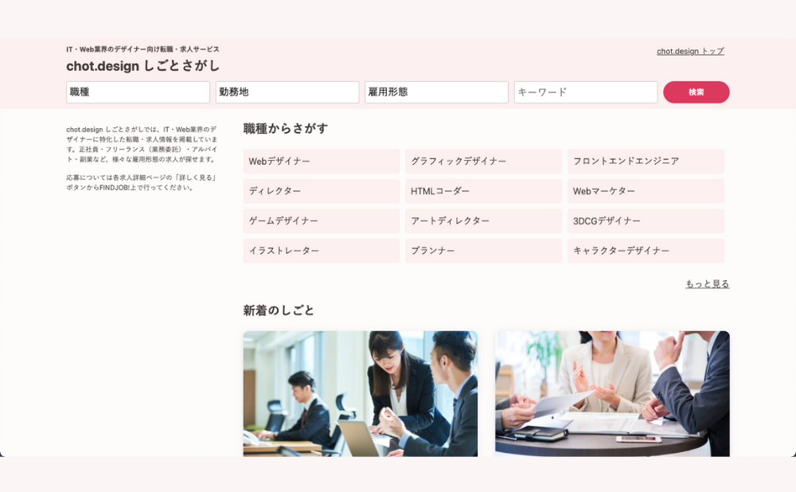

## はじめに

この記事では、本業で Web 制作をしている私自身が利用しているサービスであり、これからデザインを学ぶ方に非常におすすめしたい Web デザインの学習サービスを紹介します。

**こんな人におすすめ**

1. Web デザインスクールは料金が高くて受講できない
1. SNS 等を見てると、他人と自分の成長速度と比較してしまう
1. デザインはある程度できるけどコーディングが苦手
1. コーディングはある程度できるけどデザインが苦手

## 学習サービスの紹介

今回紹介するおすすめの Web デザイン学習サービスとは、<a href="//af.moshimo.com/af/c/click?a_id=2709936&p_id=3354&pc_id=7970&pl_id=47616&url=https%3A%2F%2Fchot.design%2Fplus%2F%3Frd_code%3D%7B%7BCODE%7D%7D" alt="chot.design" rel="nofollow" referrerpolicy="no-referrer-when-downgrade">chot.design</a> です。

- 公式サイト：<a href="//af.moshimo.com/af/c/click?a_id=2709936&p_id=3354&pc_id=7970&pl_id=47616&url=https%3A%2F%2Fchot.design%2Fplus%2F%3Frd_code%3D%7B%7BCODE%7D%7D" alt="chot.design" rel="nofollow" referrerpolicy="no-referrer-when-downgrade">chot.design ｜オンラインの Web デザイン講座</a>

chot.design とは「毎日ちょっとずつデザインを学ぼう」をコンセプトとしている、 月額 1,100 円で**学び放題**の Web デザイン学習サービスです。  
プログラミング学習サービスの Progate や ドットインストールの、デザイン版と考えるとわかりやすいでしょう。

全てのカリキュラムが有料ではなく、こちらも Progate や ドットインストールのように、一部カリキュラムは無料で学習する事ができます。

このように、無料もしくは安価な月額料金でデザインが学べるサービスは他に見かけないので、そこも非常に注目所です。以下の章では chot.design の魅力について紹介していきます。

## 学習カリキュラムの魅力

chot.design で現在公開されているカリキュラムは大きく分けて、以下の 3 つに分類されます。

1. **基礎**
1. **応用**
1. **実践**

| **基礎**                                        | **応用**                                | **実践**                         |
| ----------------------------------------------- | --------------------------------------- | -------------------------------- |
| Adobe Photoshop・Ai・XD 入門                    | AdobeXD プラグインまとめ                | Web 制作デザインテクニック       |
| UI/UX デザインツール『Figma』入門               | Figma プラグインまとめ                  | UI デザイン制作テクニック        |
| コーディングなしの Web サイト作成『STUDIO』入門 | レスポンシブ Web デザインコーディング術 | ランディングページ制作テクニック |
| Web ディレクターの基礎知識                      | CSS デザインテクニック                  | バナー制作テクニック             |
| はじめての『WordPress』入門                     | Sass を使った効率的 CSS コーディング術  | 名刺制作テクニック               |

スクロールできます➡︎

上記で紹介した公開中のカリキュラムは **ほんの一部** です。

CMS で有名な WordPress 入門講座、コードを書かずに Web サイトが作れる STUDIO 入門講座、Web ディレクターの基礎知識等、デザインにとどまらずデザインを学んだ先まで想定したカリキュラムが用意されており、chot.design で学べるカリキュラムの数はなんと、 **500 種類以上** が用意されています。

- 現在公開中のカリキュラムはこちらチェックできます ↓

<!-- af img -->

<!-- /af img -->

- 公式サイト：<a href="//af.moshimo.com/af/c/click?a_id=2709936&p_id=3354&pc_id=7970&pl_id=47616&url=https%3A%2F%2Fchot.design%2Fplus%2F%3Frd_code%3D%7B%7BCODE%7D%7D" alt="chot.design" rel="nofollow" referrerpolicy="no-referrer-when-downgrade">chot.design ｜オンラインの Web デザイン講座</a>

## カリキュラム以外の魅力

これまで紹介したカリキュラムも非常に魅力的ですが、chot.design では IT・Web 業界のデザイナーに特化した転職・求人情報も掲載されており、正社員・フリーランス（業務委託）・アルバイト・副業など、様々な雇用形態の求人を探す事ができます。

先程も述べましたが、学んだ先まで充実しているサービスはとても魅力的です。

## おわりに

この記事で紹介した chot.design は私も 有料会員 で利用しており、デザインの考え方から各ツールの使い方まで非常に学びが多く、これから学ぶ方は勿論、私のように実際に Web 業界で働いている身からしても非常に勉強になります。

**月額 1,100 円 学び放題** でとてもコスパよく学習できるので、是非ご利用してみてください。

- 公式サイト：<a href="//af.moshimo.com/af/c/click?a_id=2709936&p_id=3354&pc_id=7970&pl_id=47616&url=https%3A%2F%2Fchot.design%2Fplus%2F%3Frd_code%3D%7B%7BCODE%7D%7D" alt="chot.design" rel="nofollow" referrerpolicy="no-referrer-when-downgrade">chot.design ｜オンラインの Web デザイン講座</a>
