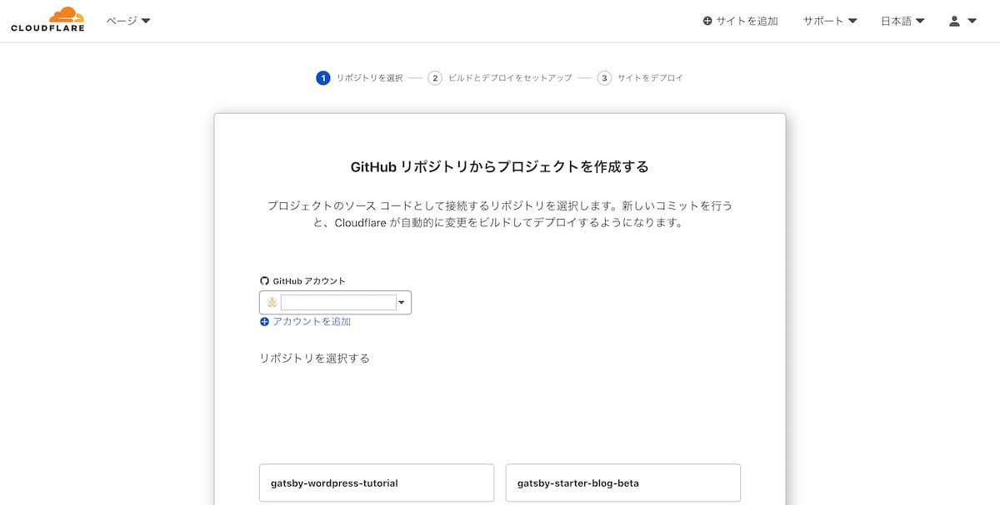
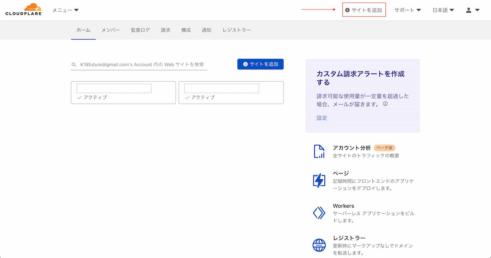

[当ブログの 1 番初めの記事](../blog-creating-at-gatsby/)では、Gatsby で作成したサイトを GatsbyCloud にデプロイし本番環境で運用しているという趣旨の記事を書きました。

ここ最近、Cloudflare Pages というものを耳にして少し調べてみると魅力的でしたので、当ブログのホスティング先を Gatsby Cloud ~ Cloudflare Pages に移行しましたのでその手順等を解説していきます。

## Cloudflare pages とは

Netlify や Vercel などと同じように、静的サイトをホスティングできるサービスです。

Cloudflare Pages の 1 番の魅力は料金体系です。  
無料で利用できる範囲がこれまでのサービスと比較すると圧倒的に大きいです。

ここでは、Cloudflare Pages の詳しい解説はしませんが、[Cloudflare Pages・Vercel ・Netlify の違いや使い分けをまとめる](https://zenn.dev/catnose99/scraps/6780379210136f) という記事に他のホスティングサービスとの比較がうまくまとまっていますので、気になる方はそちらを参考にしてみてください。

## カスタムドメインを設定する

Cloudflare Pages にデプロイしたサイトにカスタムドメインを設定する方法を解説していきますが、以下の項目を満たしている方が対象です。

- [Cloudflare Pages](https://pages.cloudflare.com/) でアカウントを作成済
- [Cloudflare Pages](https://pages.cloudflare.com/) と GitHub 対象リポジトリ の紐付け
- [Google Domains](https://domains.google/intl/ja_jp/) でドメインを取得している

※他のレジストラ（お名前.com 等）を使っている方は、それぞれの環境に合った設定してください

---

まずは、デプロイするプロジェクトの GitHub リポジトリと Coudflare Pages を紐付けて、GitHub にプッシュがされた場合に自動デプロイするようにします。

以下の画面へは、ダッシュボードサイドバーにある **ページ** 項目をクリックしていけます。

リポジトリ名.pages.dev で デプロイの確認ができたら、カスタムドメインを設定します。

ダッシュボード上部のメニューバーに **サイトを追加** という項目があるのでそちらをクリックし、ご自身のカスタムドメインを入力します。

--- 申し訳ございません、以降記事内容が反映されていません。
