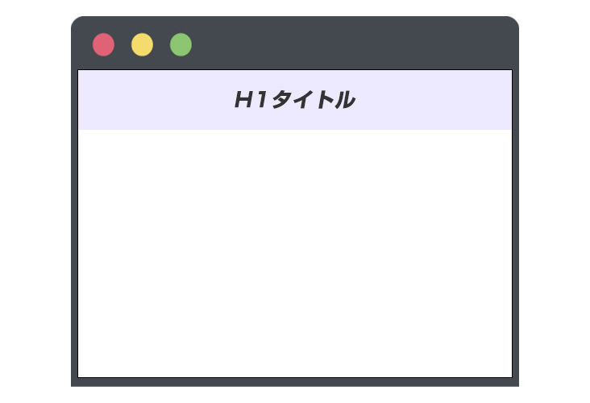
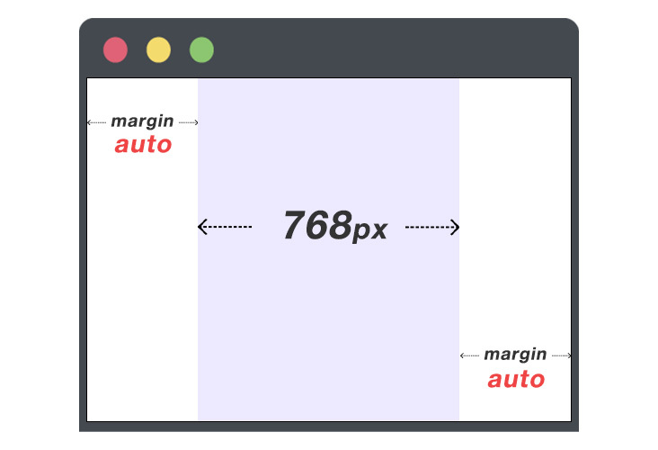

## はじめに

デザイナーの方や Web 制作をしている方は、Web ページを作成している際、CSS で特定の文章や構造を中央寄せにしたい！という場面って多々あるかと思います。

そんな時に使える、あらゆるパターンの中央寄せを紹介していきたいと思います。

## インライン要素

- **左右の中央寄せ**

テキストなどの **インライン要素** を中央寄せする場合は、ブロック要素やインラインブロック要素を持つ親要素に対して `text-align: center;` を使用します。

デフォルトだと背景色が白色でわかりずらいので、中央寄せできているかを視覚的に分かりやすくする為、背景に色つけて実装します。

```html:title=HTML
<h1 class="title">H1タイトル</h1>
```

```css{2}:title=CSS
.title {
	text-align: center;
	background-color: #ede9fe;
}
```


---

- **上下の中央寄せ**

親要素に高さの指定がある場合、中のインライン要素は上の方に寄ってしまいます。

```html:title=HTML
<h1 class="title">H1タイトル</h1>
```

```css{4}:title=親要素に高さの指定がある
.title {
	text-align: center;
	background-color: #ede9fe;
	height: 100px;
}
```


中のインライン要素の上下中央寄せを行いたい場合、`line-height: 〇〇px` を使用します。

`line-height: 〇〇px` の〇〇に入れる値は、`height` で指定されている値と同じ値を指定します。

```html:title=HTML
<h1 class="title">H1タイトル</h1>
```

```css{4,5}:title=line-heightで上下中央寄せ
.title {
	text-align: center;
	background-color: #ede9fe;
	height: 100px;
	line-height: 100px;
}
```



## ブロック要素

- **左右の中央寄せ**

Web サイト全体の横幅の指定する際によく使用します。  
使い方は `width: 〇〇px;` や `width: 〇〇%;` 等、要素に対して横幅の値を指定し、 `margin: 0 auto;` で中央寄せする事ができます。

`width` を指定せず、`margin: 0 auto;` を指定しても中央寄せにならないので注意しましょう。
今回も中央寄せできているかを視覚的に分かりやすくする為、要素の高さを画面いっぱいにし、背景に色つけて実装します。

```html:title=HTML
<div class="wrapper">
	<!-- Webサイトの中身 -->
</div>
```

```css{2,3}:title=CSS
.wrapper {
	width: 768px;
	margin: 0 auto;
	min-height: 100vh;
	background-color: #ede9fe;
}
```



---

- **上下左右中央寄せ**

上下左右中央寄せしたいブロック要素の親要素に対して

1. `display: flex;`
1. `align-items: center;`
1. `justify-content: center;`

を指定します。

```html:title=HTML
<div class="wrapper">
	<div class="inner">
		<!-- ボックス -->
	</div>
</div>
```

```css{6,7,8}:title=CSS
.wrapper {
	width: 1024px;
	margin: 0 auto;
	min-height: 100vh;
	background-color: #ede9fe;
	display: flex;
	align-items: center;
	justify-content: center;
}

/* 濃い紫色のボックスを作成 */
.inner {
	height: 420px;
	width: 420px;
	background-color: #a78bfa;
}
```


---

- 関連記事：[CSS Flexbox の使い方を完全攻略しよう！](../css-flexbox-reference/)

---

## 絶対値

絶対値 `position` を指定して CSS を記述する際、基本的には親要素に `position: relative;` 、子要素（もしくは擬似要素）に対して `position: absolute;` を使用します。

このように絶対値を使用し、要素の位置を指定する際、`top, left, right, bottom` 等の値を使用して要素の配置をします。

例えば、親要素に対して上下左右中央寄せにしたい場合、`top: 50%; left: 50%;`としただけでは上下左右中央寄せすることはできず、少し右下にズレてしまいますので、`transform: translate(-50%, -50%);` を使用することで、綺麗に上下左右中央寄せにすることができます。

```html:title=HTML
<div class="wrapper">
	<div class="inner">
		<span class="circle">
			<!-- マル -->
		</span>
	</div>
</div>
```

```css{22-24}:title=CSS
.wrapper {
	/* 先程の章と同じCSS */
}

.inner {
	width: 420px;
	height: 420px;
	background-color: #a78bfa;
	/* 絶対値の指定 */
	position: relative;
}

.circle {
	/* 白色のマルを作成 */
	display: inline-block;
	width: 100px;
	height: 100px;
	background-color: #fff;
	border-radius: 50%;
	/* 絶対値の指定 */
	position: absolute;
	top: 50%;
	left: 50%;
	transform: translate(-50%, -50%);
}
```


---

- 関連記事：[実践！CSS position をしっかり理解する](../css-position-reference/)

---

## まとめ

CSS で中央寄せする方法は今回紹介した方法以外にもありますが、実際によく使用する以下 5 つの例を紹介しました。

1. インライン要素の左右中央寄せ
1. インライン要素の上下左右中央寄せ
1. ブロック要素の左右中央寄せ
1. ブロック要素の上下左右中央寄せ
1. 絶対値の上下左右中央寄せ

この記事で紹介した CSS の指定方法は頻繁に使用し、かつ便利なので覚えとくと実際の業務でもしっかり役に立つと思います。

**関連記事**

- [【コスパ最強】Web デザイン独学の手助けになる学習サイト教えます](../chot-design-study-site/)
- [CSS Flexbox の使い方を完全攻略しよう！](../css-flexbox-reference/)
