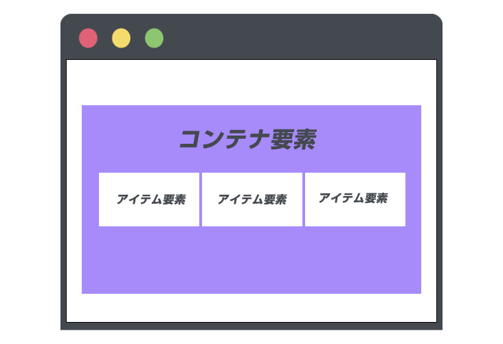
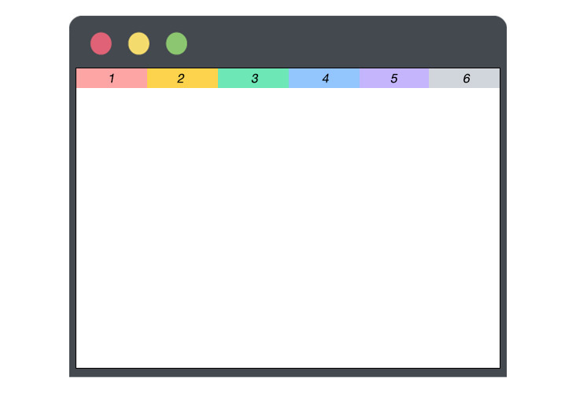
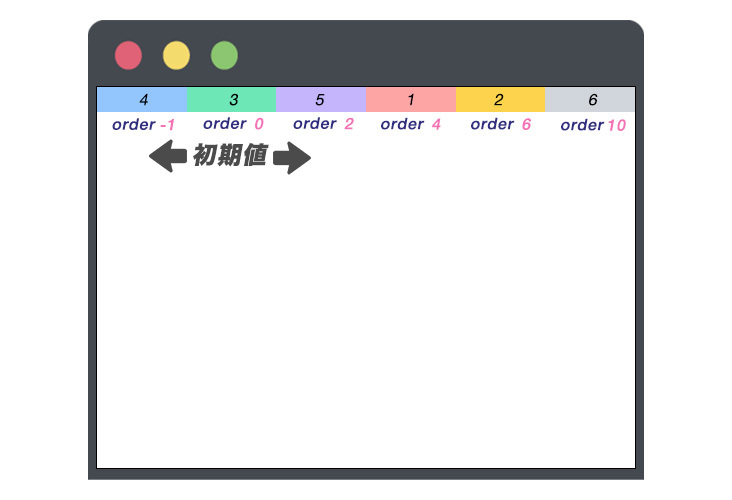
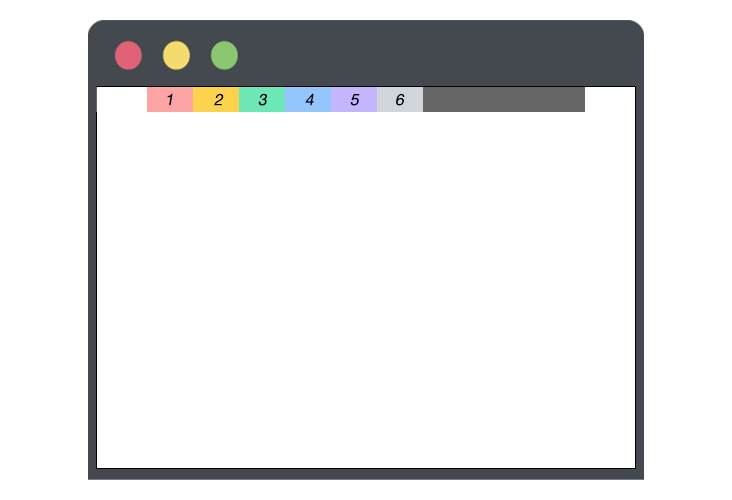
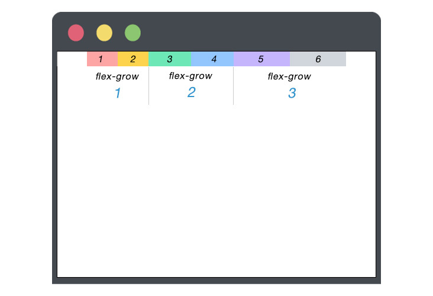
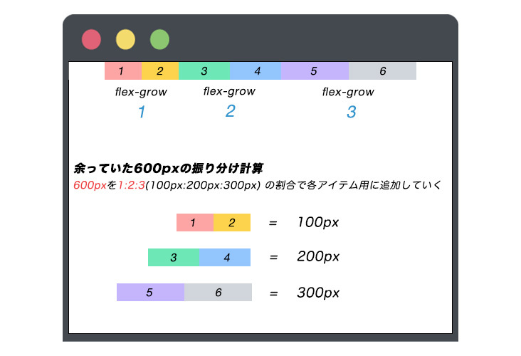
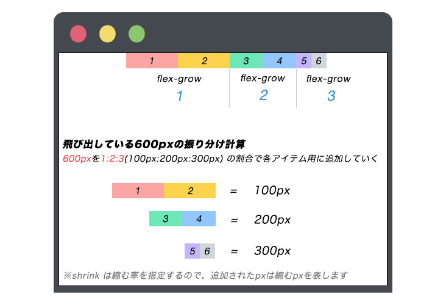

---

この記事は [30 枚以上の図で解説！基礎から学ぶ CSS flexbox （コンテナ要素編）](../css-flex-box-container/) の続きの記事になります。


- 前回の記事：[30 枚以上の図で解説！基礎から学ぶ CSS flexbox （コンテナ要素編）](../css-flex-box-container/)

---

## flexbox の基礎

前回のコンテナ要素の解説記事でも触れましたが、flexbox は**コンテナ要素**（親要素）と**アイテム要素**（子要素）という 2 つの要素によりレイアウトを構成します。



今回は、アイテム要素（子要素）に焦点を当て、指定できるプロパティやその値を徹底的に解説していきます。

---

今回の解説に使用するコードは下記になります。

```html:title=解説用のHTMLコード
<div class="container">
	<div class="item-1">1</div>
	<div class="item-2">2</div>
	<div class="item-3">3</div>
	<div class="item-4">4</div>
	<div class="item-5">5</div>
	<div class="item-6">6</div>
</div>
```

```css:title=解説用のCSSコード
.container {
	background-color: #666;
	text-align: center;
	display: flex;
}

.container div {
	width: 100%;
}
.item-1 {
	background-color: #fca5a5;
}
.item-2 {
	background-color: #fcd34d;
}
.item-3 {
	background-color: #6ee7b7;
}
.item-4 {
	background-color: #93c5fd;
}
.item-5 {
	background-color: #c4b5fd;
}
.item-6 {
	background-color: #d1d5db;
}
```

**現在の表示**



## アイテム要素の初期値

コンテナ要素（親要素）同様、アイテム要素（子要素）も初期値の値を持っています。

コンテナ要素（親要素）に `display: flex;` が指定されている場合、アイテム要素（子要素）に初期値として振られているのが以下のプロパティとその値です。

```css{3-5}:title=アイテム要素の初期値
/* 上記の解説コードだと .item-1 ~ .item-6 の初期値 */
.item {
	flex-grow: 0;
	flex-shrink: 1;
	flex-basis: auto;
}
```

## `order`

flexbox のコンテナ要素の中で、アイテム要素に対して `order: 数値;` 振り分けることで HTML の記述に関わらず、アイテム要素の順序を設定できます。

マイナスの値も指定する事ができます。

```css{3,7,11,15,19,23}
.item-1 {
	background-color: #fca5a5;
	order: 4;
}
.item-2 {
	background-color: #fcd34d;
	order: 6;
}
.item-3 {
	background-color: #6ee7b7;
	/* order を指定しない場合の初期値は0 */
}
.item-4 {
	background-color: #93c5fd;
	order: -1;
}
.item-5 {
	background-color: #c4b5fd;
	order: 2;
}
.item-6 {
	background-color: #d1d5db;
	order: 10;
}
```



指定する数値は必ずしも順序よく指定するというルールはありません。  
値で指定した **数値が高い方が優先される** という仕組みなのでしっかり覚えときましょう。

## flex-grow

flexbox コンテナ内の要素でアイテム要素に対して `flex-grow: 数値;` を指定することで、アイテム要素の伸び率を設定できます。

これから詳しく解説していきますが、`flex-grow` は **余ったスペースを各アイテム要素で分け合う** 際に使うプロパティです。

[アイテム要素の初期値](#アイテム要素の初期値) の章で少し触れましたが、 `flex-grow` の初期値は 0 です。

---

解説用コードのコンテナ要素にしている CSS とアイテム要素全てに対して指定している CSS を変更します。

```css{5,6,11}:title=ハイライトの箇所が追加
.container {
	background-color: #666;
	text-align: center;
	display: flex;
	width: 1200px;
	margin: auto;
}
/* 全てのアイテム要素に width: 100px; を指定 */
.container div {
	/* width: 100%; */
	width: 100px;
}
```

**現在の表示**



---

- 関連記事：[もう迷わない！役に立つ CSS 中央寄せ 5 選](../css-center-reference/)

---

各アイテム要素に対して、`flex-grow` を指定していきます。

```css{3,7,11,15,19,23}
.item-1 {
	background-color: #fca5a5;
	flex-grow: 1;
}
.item-2 {
	background-color: #fcd34d;
	flex-grow: 1;
}
.item-3 {
	background-color: #6ee7b7;
	flex-grow: 2;
}
.item-4 {
	background-color: #93c5fd;
	flex-grow: 2;
}
.item-5 {
	background-color: #c4b5fd;
	flex-grow: 3;
}
.item-6 {
	background-color: #d1d5db;
	flex-grow: 3;
}
```



余ったスペースをアイテム要素で分け合い、コンテナ要素の幅いっぱい広がっているのがわかるかと思います。  
なぜこのような動きになるのか解説していきます。

今回コンテナ要素の横幅は `1200px` で指定し、各アイテム要素の横幅は `100px` で指定したので、全てのアイテム要素の横幅の合計は `600px` で余ったスペースも `600px` でした。

```md
コンテナ幅 - 6 つのアイテム要素合計の横幅 = 余ったスペース
1200px - 600px = 600px
```

この余ったスペース **600px** を **1:2:3** で再分配したということになります。



- **指定後の各アイテム要素の幅の変化**

| アイテム要素    | 指定前 | 指定後 | 伸びた幅    | 合計  |
| --------------- | ------ | ------ | ----------- | ----- |
| item-1 , item-2 | 100px  | 150px  | **+ 50px**  | 100px |
| item-3 , item-4 | 100px  | 200px  | **+ 100px** | 200px |
| item-5 , item-6 | 100px  | 250px  | **+ 150px** | 300px |

## flex-shrink

flexbox コンテナ内の要素でアイテム要素に対して `flex-shrink: 数値;` を指定することで、アイテム要素の縮む率を設定できます。先程の `flex-grow` の逆と考えるとすんなり理解できます。

これから詳しく解説していきますが、`flex-shrink` は **アイテム要素がコンテナ要素の幅より大きい** 際に使うプロパティです。

[アイテム要素の初期値](#アイテム要素の初期値) の章で少し触れましたが、 `flex-shrink` の初期値は 1 です。

---

解説用コードのコンテナ要素にしている CSS とアイテム要素全てに対して指定している CSS を変更します。

```css{5,9}
.container {
	background-color: #666;
	text-align: center;
	display: flex;
	width: 600px;
	margin: auto;
}
/* アイテム要素全てに対して200pxを指定 */
.container div {
	width: 200px;
}
```

**現在の表示**


ここで注目すべき点はコンテナ要素の幅が `600px`、アイテム要素の合計の幅が `1200px` でもコンテナ要素を飛び出さずに縮んで各アイテム要素 `100px`、合計で `600px` になっています。

なぜこうなるかというと、初期値である `flex-shrink: 1;` が全てのアイテム要素に効いてる為です。

比率は、コンテナ要素を飛び出した幅 `600px` を 1 : 1 : 1 : 1 : 1 : 1（100px : 100px : 100px : 100px : 100px : 100px） で各アイテム要素に振り分けています。

---

`flex-shrink` は初期値でも値があり、その動きを確認できましたが応用として各アイテム要素に対して値を指定し、その動きを確認していきます。

```css{3,7,11,15,19,23}
.item-1 {
	background-color: #fca5a5;
	flex-shrink: 1;
}
.item-2 {
	background-color: #fcd34d;
	flex-shrink: 1;
}
.item-3 {
	background-color: #6ee7b7;
	flex-shrink: 2;
}
.item-4 {
	background-color: #93c5fd;
	flex-shrink: 2;
}
.item-5 {
	background-color: #c4b5fd;
	flex-shrink: 3;
}
.item-6 {
	background-color: #d1d5db;
	flex-shrink: 3;
}
```


先程の `flex-grow` と違い、値が大きい程要素の幅は縮んでいるのがわかるかと思います。

今回コンテナ要素の横幅は `600px` で指定し、各アイテム要素の横幅は `200px` で指定したので、全てのアイテム要素の横幅の合計は `1200px` で飛び出している幅は `600px` でした。

```md
6 つのアイテム要素合計の横幅 - コンテナ幅 = 飛び出している幅
1200px - 600px = 600px
```

この飛び出している幅 **600px** を **1:2:3** で再分配したということになります。



- **指定後の各アイテム要素の幅の変化**

| アイテム要素    | 指定前 | 指定後 | 縮んだ幅    | 合計  |
| --------------- | ------ | ------ | ----------- | ----- |
| item-1 , item-2 | 200px  | 150px  | **- 50px**  | 100px |
| item-3 , item-4 | 200px  | 100px  | **- 100px** | 200px |
| item-5 , item-6 | 200px  | 50px   | **- 150px** | 300px |

## flex-basis

flexbox コンテナ内の要素でアイテム要素に対して `flex-basis: 数値;` を指定することで、アイテム要素の横幅を指定することができます。初期値は `flex-basis: auto;` です。

指定できる数値は `width` と同じく `px rem em` や `%` で値を決めることができます。  
`width` との違いは `width` と `flex-basis` を同じアイテム要素に指定した場合、`flex-basis` の値が優先して表示されます。

```css{4}:title=アイテム要素
/* flex-basisの値が優先される */
.item {
	width: 100px;
	flex-basis: 40px;
}
```

## flex

これまで解説した `flex-grow`, `flex-shrink`, `flex-basis` の値を一括で指定できるプロパティです。  
`flex` の初期値はそれぞれのプロパティの初期値の値になります。

```css
.item {
	/* flex: flex-growの値 flex-shrinkの値 flex-basisの値; */
	flex: 0 1 auto;
}
```

## align-self

`align-self` はコンテナ内のアイテム要素に対して指定プロパティで、コンテナ要素で指定できる `align-items` と同じ動きをします。

1. `align-self: stretch;`
1. `align-self: flex-start;`
1. `align-self: center;`
1. `align-self: flex-end;`
1. `align-self: baseline;`

特徴としては、`align-self` は `align-items` で指定した値より優先度が高くなります。

指定できる値も同じなので解説はコンテナ要素の解説記事で詳しくしているので気になる方はそちらをチェックしてみてください。

- 関連記事：[30 枚以上の図で解説！基礎から学ぶ CSS flexbox （コンテナ要素編）](../css-flex-box-container/)

## まとめ

コンテナ要素の解説記事に続いて、アイテム要素の基礎から徹底的に解説しました。

CSS の flexbox に関しては前回の記事（コンテナ要素編）、今回のアイテム要素についての記事をしっかり理解できれば flexbox を使い、複雑なレイアウトもなんなく構築できるようになりますのでしっかり理解していきましょう。

## おすすめ記事

1. [30 枚以上の図で解説！基礎から学ぶ CSS flexbox （コンテナ要素編）](../css-flex-box-container/)
1. [もう迷わない！役に立つ CSS 中央寄せ 5 選](../css-center-reference/)
