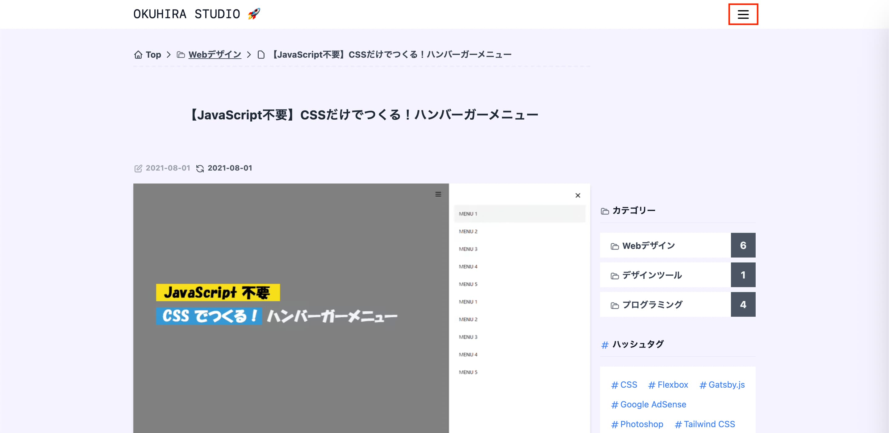

## はじめに

この記事では、**JavaScript を使わずに CSS だけでハンバーガーメニューを作る方法** を解説していきます。

今回作成するハンバーガーメニューのデモを以下に用意しました。  
どのような動きをするのか試してみたい方は右上のアイコンをクリックしてみて下さい。

<iframe title="CSS hamburger-menu" src="https://okuhira-studio-reference.netlify.app/hamburger-menu/index.html" width="600" height="400"></iframe>

<span class="block text-gray-700 text-sm text-center">↑ 今回作成するハンバーガーメニューのデモ</span>

## ハンバーガーメニューとは

ハンバーガーメニューとは、Web サイトや Web アプリケーションの画面上部に設置されているメニューのことを指しています。横 3 本線でそのメニューを実装するケースが多いことからハンバーガーメニューと呼ばれています。

当サイトにも画面上部にて、ハンバーガーメニューを設置しています。



## ハンバーガーメニューの作り方

ハンバーガーメニューの作り方は主に、メニューボタンの横 3 本線を `<span></span>` で実装する方法・メニューボタンをアイコンで実装する方法があります。  
今回は、メニューボタンをアイコンで実装する方法について解説していきます。

---

メニューボタンは Font Awesome icon を使いますので、Font Awesome icon の CDN を `<head></head>` 内に記述して下さい。

<div class="iframely-embed mb-2"><div class="iframely-responsive" style="height: 140px; padding-bottom: 0;"><a href="https://fontawesome.com" data-iframely-url="//cdn.iframe.ly/api/iframe?url=https%3A%2F%2Ffontawesome.com%2Fv5.15%2Ficons&amp;key=d4798a05d91c041893af4b71314755fa"></a></div></div>

```html{2}:title=FontAwesomeiconのCDN
<head>
	<link rel="stylesheet" href="https://cdnjs.cloudflare.com/ajax/libs/font-awesome/5.11.2/css/all.css" />
</head>
```

---

まずは、ヘッダー要素と Font Awesome icon を使ったハンバーガーメニューの見た目を実装していきます。

```html:title=HTML
<header>
	<div>
		<input id="menu-checkbox" type="checkbox" />
		<label class="menu-btn" for="menu-checkbox">
			<i class="fas fa-bars"></i>
		</label>
	</div>
</header>
```

```css:title=CSS
header {
	background-color: #f9fafb;
}
header > div {
	max-width: 980px;
	margin: 0 auto;
	padding: 8px;
	text-align: right;
}
/* Font Awesome icon のスタイル */
.menu-btn > i {
	display: inline-block;
	padding: 12px;
	cursor: pointer;
	border-radius: 50%;
}
.menu-btn > i:hover {
	background-color: #f3f4f6;
}
```

現在の見た目は以下のようになっているかと思います。  
アイコンをクリックすると、チェックボックスがアクティブ状態になるのがわかるかと思います。
CSS だけでハンバーガーメニューを実装する際は、このチェックボックスを利用します。

- メニューボタンクリックしていない時


- メニューボタンクリックした時


チェックボックスの機能を利用するだけで、チェックボックス自体の表示は不要ですので CSS で見えないように記述します。

```css{11-13}:title=チェックボックスを非表示
header {
	background-color: #f9fafb;
}
header > div {
	max-width: 980px;
	margin: 0 auto;
	padding: 8px;
	text-align: right;
}
/* チェックボックスを非表示 */
#menu-checkbox {
	display: none;
}
/* Font Awesome icon のスタイル */
.menu-btn > i {
	display: inline-block;
	padding: 12px;
	cursor: pointer;
	border-radius: 50%;
}
.menu-btn > i:hover {
	background-color: #f3f4f6;
}
```

---

次は、ハンバーガーメニューをクリックした時に出てくるメニューコンテンツを実装していきます。

```html{7-28}:title=メニューコンテンツの実装
<header>
	<div>
		<input id="menu-checkbox" type="checkbox" />
		<label class="menu-btn" for="menu-checkbox">
			<i class="fas fa-bars"></i>
		</label>
    <div class="nav-content">
      <input id="menu-checkbox" type="checkbox" />
      <label class="menu-btn" for="menu-checkbox">
        <i class="fas fa-times"></i>
      </label>
      <nav class="nav-menu">
        <ul>
          <li>
            <a href="#">MENU</a>
          </li>
          <li>
            <a href="#">MENU</a>
          </li>
          <li>
            <a href="#">MENU</a>
          </li>
          <li>
            <a href="#">MENU</a>
          </li>
        </ul>
      </nav>
    </div>
	</div>
</header>
```

```css{}:title=メニューコンテンツは、画面外に配置します
.nav-content {
	background-color: white;
	width: 80%;
	max-width: 450px;
	height: 100%;
	position: fixed;
	top: 0;
	right: 0;
	z-index: 50;
	padding: 8px;
	overflow: auto;
	transform: translateX(100%); /* 画面外に配置 */
	transition-duration: 300ms;
}
.nav-menu ul {
	list-style: none;
	text-align: left;
}
.nav-menu li > a {
	text-decoration: none;
	color: black;
	padding: 12px;
	display: block;
}
.nav-menu li > a:hover {
	background-color: #f3f4f6;
}
/* チェックボックスがアクティブ状態の時、画面内に表示 */
#menu-checkbox:checked ~ .nav-content {
	transform: translateX(0%);
}
```

---

現状だと、ハンバーガーメニューをクリックした時に表示されるメニューコンテンツは、バツアイコンをクリックしないと閉じませんが、これだと非常に不便ですのでハンバーガーメニューをクリックした際は、メニューコンテンツ以外の画面をクリックしても閉じるように実装していきます。

```html{29}:title=バツアイコン以外をクリックしても閉じる実装
<header>
	<div>
		<input id="menu-checkbox" type="checkbox" />
		<label class="menu-btn" for="menu-checkbox">
			<i class="fas fa-bars"></i>
		</label>
    <div class="nav-content">
      <input id="menu-checkbox" type="checkbox" />
      <label class="menu-btn" for="menu-checkbox">
        <i class="fas fa-times"></i>
      </label>
      <nav class="nav-menu">
        <ul>
          <li>
            <a href="#">MENU</a>
          </li>
          <li>
            <a href="#">MENU</a>
          </li>
          <li>
            <a href="#">MENU</a>
          </li>
          <li>
            <a href="#">MENU</a>
          </li>
        </ul>
      </nav>
    </div>
    <label class="nav-close" for="menu-checkbox"></label>
	</div>
</header>
```

```css{}:title=CSSを追加
#menu-checkbox:checked ~ .nav-close {
	display: block;
	opacity: 0.5;
}
```

- CSS だけで実装したハンバーガーメニュー

<iframe title="CSS hamburger-menu" src="https://okuhira-studio-reference.netlify.app/hamburger-menu/index.html" width="600" height="400"></iframe>

今回は、細かい CSS の挙動については詳しく触れていませんが、作成したものを自分なりにアレンジしてアニメーションなどを実装してみるのも面白いので是非チャレンジしてみて下さい。

## コピペ用

実装した HTML と CSS のコードを全て記載しておきますので、ご自由にご利用ください。

```html
<header>
	<div>
		<input id="menu-checkbox" type="checkbox" />
		<label class="menu-btn" for="menu-checkbox">
			<i class="fas fa-bars"></i>
		</label>
		<div class="nav-content">
			<input id="menu-checkbox" type="checkbox" />
			<label class="menu-btn" for="menu-checkbox">
				<i class="fas fa-times"></i>
			</label>
			<nav class="nav-menu">
				<ul>
					<li>
						<a href="#">MENU</a>
					</li>
					<li>
						<a href="#">MENU</a>
					</li>
					<li>
						<a href="#">MENU</a>
					</li>
					<li>
						<a href="#">MENU</a>
					</li>
				</ul>
			</nav>
		</div>
		<label class="nav-close" for="menu-checkbox"> </label>
	</div>
</header>
```

```css
header {
	background-color: #f9fafb;
}
header > div {
	max-width: 980px;
	margin: 0 auto;
	padding: 8px;
	text-align: right;
}

.menu-btn > i {
	display: inline-block;
	padding: 12px;
	cursor: pointer;
	border-radius: 50%;
}
.menu-btn > i:hover {
	background-color: #f3f4f6;
}

.nav-content {
	background-color: white;
	width: 80%;
	max-width: 450px;
	height: 100%;
	position: fixed;
	top: 0;
	right: 0;
	z-index: 50;
	padding: 8px;
	overflow: auto;
	transform: translateX(100%);
	transition-duration: 300ms;
}
.nav-menu ul {
	list-style: none;
	text-align: left;
}
.nav-menu li > a {
	text-decoration: none;
	color: black;
	padding: 12px;
	display: block;
}
.nav-menu li > a:hover {
	background-color: #f3f4f6;
}

.nav-close {
	display: none;
	background-color: black;
	opacity: 0;
	width: 100%;
	height: 100%;
	position: fixed;
	top: 0;
	right: 0;
	z-index: 40;
	transition-duration: 300ms;
}

#menu-checkbox {
	display: none;
}
#menu-checkbox:checked ~ .nav-close {
	display: block;
	opacity: 0.5;
}
#menu-checkbox:checked ~ .nav-content {
	transform: translateX(0%);
}
```
