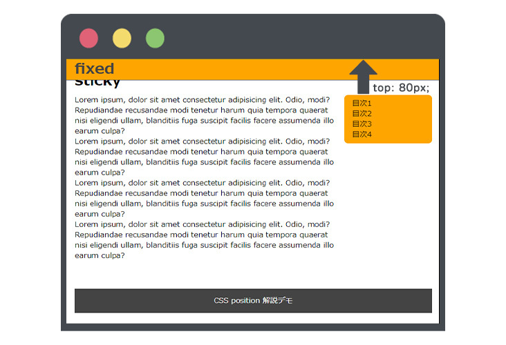

## はじめに

この記事では、CSS の `position` プロパティについて基礎から解説し、色々な Web サイトで `position` が使われている例やその仕組み、実践的な使い方まで解説します。

今回の解説で使用するデモを用意したので、一度スクロールしてみてください。

**デモ**

<iframe title="CSS position sample" src="https://okuhira-studio-reference.netlify.app/position/index.html" width="600" height="400"></iframe>

現時点では全く理解出来ていなくても大丈夫です。少しおかしな動きをする要素や他の Web サイトでみたことのあるような動きをする要素がいくつかあると思います。

`position` を使えるようになると、デザインにおいても表現できる幅がグッと上がるのでしっかり押さえときましょう。

## position とは

position とは、対象の **要素の位置を決める** プロパティです。

当サイトでも `position` を使用してレイアウトを構築している箇所が多々あります。記事内だと、ヘッダーや（PC で閲覧の場合のみ）サイドバーに `position` を使用しています。

ヘッダーはスクロールしても画面の上にピッタリと引っ付き、サイドバーは一定の位置で止まっていて記事の最後まで行くと固定されていたものが解除されスクロールできるようになります。

このようなレイアウトは他のサイトでも多々見かけると思いますが、これらは主に `position` を使ってレイアウトを構築しているということです。

## position の使い方

`position` プロパティを使い、表現したいレイアウトに適した値を指定します。

```css{2}:title=positionの指定
div {
	position: 〇〇;
}
```

この値（上記の〇〇の部分）に指定できるのが以下の 5 つになります。

1. `static`
1. `fixed`
1. `relative`
1. `absolute`
1. `sticky`

また、上の 5 つに合わせて **top, right, bottom, left** を指定してすることで、期待した通りのレイアウトを構築できるようになります。

`position` を指定しても、最終的に要素の位置を決めるのは `top`, `right`, `bottom`, `left` で指定した値ですので、**合わせて使う** ということをしっかり覚えましょう。

```css{6-9}:title=positionを使った位置の指定
div {
  position: 〇〇;
  /**
   px, rem, em, % も指定できます
  */
  top: 〇〇px;
  bottom: 〇〇px;
  left: 〇〇px;
  right: 〇〇px;
}
```

`top, right, bottom, left` に関してはこれら全てを同時に使うことはあまりなく、状況に応じて適したものを指定していく形になります。

次の章からは、これらの基礎的な使い方から実際の Web サイトでよく使われているパターンを例に解説していきます。

## static

`position: static;` は **初期値** です。

```html:title=HTML
<div>
	<p>Hello</p>
</div>
```

```css:title=CSS
div {
	position: static;
}
```

こちらの `static` は意図して使用する場面は非常少ないと思いますので、以下の 特徴 だけ頭に入れておくと良いでしょう。

**特徴**

1. CSS で `position` をしていない要素は、全て初期値で `static` になっている
1. `top, right, bottom, left` など位置の指定をしても動かない
1. `z-index` を指定しても要素の重なり順を変更できない

---

意図して記述する場面は非常に少ないと言いましたが、使用する場面がある例としては、レスポンシブ対応の Web サイトを特定のデバイスでは `position` の指定を解除したいという場面くらいかと思いますので、頭に入れておくと良いと思います。

```css:title=対応デバイスの切り替えの際に指定する例
div {
	position: static;
}
@media (min-width: 768px) {
	div {
		position: absolute;
	}
}
```

## fixed

`position: fixed` は **ブラウザの画面幅を基準** として、位置を指定できます。  
よく使われている場面としては、サイトのヘッダーをイメージすると実感しやすいかと思います。

以下デモの 1 番上の **fixed** と記述されている要素に注目してスクロールしてみてください。

**デモ**

<iframe title="CSS position sample" src="https://okuhira-studio-reference.netlify.app/position/index.html" width="600" height="400"></iframe>

1 番上の fixed と記述されている要素 **スクロールしてもその位置から動かない** のがわかるかとおもいます。  
上記の fixed の要素に指定されている HTML と CSS は以下のようになります。

```html:title=HTML
<header class="header">
	<h1>fixed</h1>
</header>
```

```css{2-4}:title=CSS
	.header {
	position: fixed;
	top: 0;
  left: 0;
  /* 見た目の装飾 */
	z-index: 999;
	width: 100%;
	background-color: orange;
	color: #444;
}
```

**top: 0; left: 0;** を指定することで、ブラウザ画面の **左上** にピッタリくっつくようなレイアウトが指定できます。

**point**

さらっと書かれている `z-index` ですが、これは要素の重なり順を指定するプロパティで、これを指定しないとスクロールした時に画面の下に隠れてしまうので、 `z-index` の値を指定してどの要素よりも優先順位を高く指定しているということになります。

```css{6}:title=z-indexの指定
	.header {
	position: fixed;
	top: 0;
  left: 0;
  /* 見た目の装飾 */
	z-index: 999;
	width: 100%;
	background-color: orange;
	color: #444;
}
```

**z-index を指定しなかった場合**

<iframe title="CSS position sample" src="https://okuhira-studio-reference.netlify.app/position/z-index-0.html" width="600" height="400"></iframe>

`z-index: 999;` は大胆ですが、ヘッダーなど他の要素よりも優先度が高くあるべき要素に対しては、`z-index` の数値も高めに設定することでしっかりその役割を果たしてくれます。

## relative

`position: relative;` は要素に対して指定した際、今いる要素の位置から `top, left, botttom, right` で指定した値に基づき、その要素を配置することができます。

以下デモの **relative** と書かれた箇所をご覧ください。

**デモ**

<iframe title="CSS position sample" src="https://okuhira-studio-reference.netlify.app/position/index.html" width="600" height="400"></iframe>

2 つの item と書かれた要素があります。  
1 つめの item は `position` を指定していない例で、2 つめのアイテム要素が `position` を使用した例になります。  
これら 2 つの HTML, CSS は以下のようになります。

```html
<div class="container">
	<div class="item">item</div>
</div>
```

```css:title=1つめのitem要素
/* オレンジの枠 */
.container {
  width: 300px;
  height: 150px;
  border: 3px solid orange;
}
/* item 要素 */
.item {
  padding: 8px;
  background-color: #444;
  color: #cdcdcd;
}
```

```css{12-14}:title=2つめのpositionを使用したitem要素
/* オレンジの枠 */
.container {
  width: 300px;
  height: 150px;
  border: 3px solid orange;
}
/* item 要素 */
.item {
  padding: 8px;
  background-color: #444;
  color: #cdcdcd;
  position: relative;
  top: 16px;
  left: 16px;
}
```

- 元いた位置の上から 16px の位置に移動
- 元いた位置の左から 16px の位置に移動

`position: relative;` と合わせて `top, left` を使って値を指定することで、**元いた位置から指定した値の分だけ移動する** のがこの `position: relative;` ということになります。

## absolute

`position: absolute;` は、親要素で指定された `position: relative;` を基準として、`top, left, bottom, right` で指定した値に基づき要素を配置します。

この `absolute` を理解し、使いこなす上で重要な point は **親要素に relative を指定** し、**子要素に absolute を指定** することです。

以下デモの **absolute** と書かれた箇所をご覧ください。

**デモ**

<iframe title="CSS position sample" src="https://okuhira-studio-reference.netlify.app/position/index.html" width="600" height="400"></iframe>

4 枚の猫の画像があり、 Animal と書かれた要素が各画像に配置されています。  
これらの HTML と CSS は以下のようになります。

```html{1,2,7}:title=1枚目の画像の例
<div class="relative">
	<span class="absolute">Animal</span>
	<figure>
		
		<figcaption>top: 0; left: 0;</figcaption>
	</figure>
</div>
```

```css{2,9-11}
.relative {
	position: relative;
  /* 見た目の装飾 */
	width: 120px;
	height: 120px;
	margin-right: 16px;
}
.absolute {
  position: absolute;
  top: 0;
  left: 0;
  /* 見た目の装飾 */
  display: inline-block;
  background-color: orange;
  color: #444;
  font-weight: bold;
  padding: 4px;
}
```

このように親要素に `relative` を指定し、子要素に `absolute` と `top left` を指定することで **親要素を基準** として要素を配置することができます。

2 枚目：`top: 0; right: 0;` -> 右上  
3 枚目：`bottom: 0; left: 0;` -> 右下  
4 枚目：`bottom: 0; right: 0;` -> 左下

**親要素に relative を指定しない場合**

親要素に `position: relative;` を指定せず、`position: absolute;` のみ指定した場合はその `absolute` を指定した要素は `relative` を上に上にと探しにいき、見つからない場合は画面の上に引っ付いたりと、意図しない動きをします。

**結論**

`position: absolute;` を使うときは、基準にしたい親要素に対して `position: relative;` を指定し、子要素に `position: absolute;` を指定して **2 つセットで一緒に使う** ということを意識しましょう。

## sticky

`position: sticky;` は親要素に依存し、`top, left, bottom, right` で指定した値に基づき要素を配置します。

これだと少しわかりづらいと思いますので、デモを元に解説していきます。  
以下デモの **sticky** と記述された箇所に注目してスクロールしてみてください。

**デモ**

<iframe title="CSS position sample" src="https://okuhira-studio-reference.netlify.app/position/index.html" width="600" height="400"></iframe>

**sticky** という文字を通り過ぎた後、サイドバーの目次欄が固定され、スクロールを続けると固定さていたものが解除されます。

これらの HTML と CSS は以下のようになります。

```html{13-20}:title=HTML
<section>
	<h2>sticky</h2>
	<div class="container">
		<main>
			<p>
				Lorem ipsum, dolor sit amet consectetur adipisicing elit. Odio, modi?
				Repudiandae recusandae modi tenetur harum quia tempora quaerat nisi
				eligendi ullam, blanditiis fuga suscipit facilis facere assumenda illo
				earum culpa? . .
			</p>
		</main>
		<aside>
			<nav class="toc">
				<ul>
					<li>目次1</li>
					<li>目次2</li>
					<li>目次3</li>
					<li>目次4</li>
				</ul>
			</nav>
		</aside>
	</div>
</section>
```

```css{15,16}:title=CSS
/* 見た目の装飾 */
.container {
	display: flex;
	justify-content: center;
}
.container > main {
	width: 75%;
	margin-right: 16px;
}
.container > aside {
	width: 25%;
}
/* sticky */
.toc {
	position: sticky;
	top: 80px;
	padding: 8px 16px;
	background-color: orange;
	border-radius: 8px;
}
```

上記のコードをみてみると、`<nav class="toc">` タグに対して `position: absolute; top: 80px;` と指定されているのがわかるかと思います。

`top: 80px;` は `position: sticky;` を指定した要素の上に 80px の隙間を保持して固定されます。



この章の初めに **position: sticky; は親要素に依存し** と言いましたが、この`<nav></nav>` は親要素の `<aside></aside>` タグに依存しているということになります。

つまり、この `position: sticky;` の効果が得られるのは、画面内に`<aside></aside>` タグが表示されている時のみということです。

わかりやすいように親要素の `<aside></aside>` タグに背景色をつけてみます。

```css{3}:title=asideタグに背景色を追加
.container > aside {
	width: 25%;
  background-color: #cdcdcd;
}
/* sticky */
.toc {
	position: sticky;
	top: 80px;
	padding: 8px 16px;
	background-color: orange;
	border-radius: 8px;
}
```

<iframe title="CSS position sample" src="https://okuhira-studio-reference.netlify.app/position/sticky.html" width="600" height="400"></iframe>

このように、`<aside></aside>` タグが画面内から上にスクロールしていくと同時に `position: sticky;` で指定した要素も固定されていたものが解除され、通常の要素と同じ動きに戻ります。

**sticky の注意点**

`position: sticky;` を指定しても思ったように固定されない場面が出てくること思います。気をつけるべきことは、**position: sticky; を指定した要素内に単一の要素しかない場合はうまく固定されない** ので注意しましょう。

難しい表現ですが、`sticky` を指定した直下の子要素は、更に親要素として機能しており自身が子要素を持っている要素でなくてはいけません。

```html
<!-- stickyが機能する -->
<aside>
	<nav class="toc">
		<!-- stickyを指定した直下の子要素は <li> の親要素でもある -->
		<ul>
			<li>目次1</li>
			<li>目次2</li>
			<li>目次3</li>
			<li>目次4</li>
		</ul>
	</nav>
</aside>
<!-- stickyが機能しない -->
<aside>
	<nav>
		<ul class="toc">
			<!-- stickyを指定した直下の子要素は 自身が子要素を持っていない -->
			<li>目次1</li>
			<li>目次2</li>
			<li>目次3</li>
			<li>目次4</li>
		</ul>
	</nav>
</aside>
```

このように sticky は少し癖がありますが、使い慣れればとても便利な値ですので是非習得してください！

## まとめ

**position で使える 5 つの値**

1. `static`
1. `fixed`
1. `relative`
1. `absolute`
1. `sticky`

**position と一緒に使うプロパティ**

1. top
1. left
1. right
1. bottom

**関連記事**

- [【コスパ最強】Web デザイン独学の手助けになる学習サイト教えます](../chot-design-study-site/)
- [CSS Flexbox の使い方を完全攻略しよう！](../css-flexbox-reference/)
