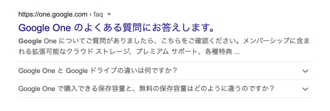
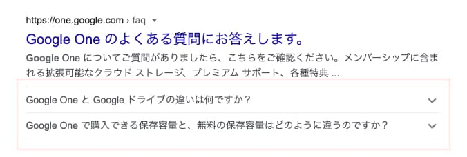

特定のキーワードの検索結果ページにて、表示されているサイトの中にそのページを開かなくても以下のように検索結果ページ上で、FAQ がパネル表示で展開されていることがあります。





これらは **リッチリザルト** といい、適切な構造化データマークアップをすることにより検索結果に表示させることが出来ます。

今回紹介する FAQ リッチリザルト以外にも、約 30 種類程度のリッチリザルトが存在します。  
興味がある方は、検索セントラルにて調べてみて下さい。

<div class="iframely-embed"><div class="iframely-responsive" style="height: 140px; padding-bottom: 0;"><a href="https://developers.google.com/search/docs/advanced/structured-data/faqpage?hl=ja" data-iframely-url="//cdn.iframe.ly/api/iframe?url=https%3A%2F%2Fdevelopers.google.com%2Fsearch%2Fdocs%2Fadvanced%2Fstructured-data%2Ffaqpage%3Fhl%3Dja&amp;key=d4798a05d91c041893af4b71314755fa"></a></div></div>

---

## FAQ 構造化データマークアップ

構造化データマークアップは、[FAQPage - schema.org](https://schema.org/FAQPage) を参考に進めていきます。

よくある質問（FAQ）の構造化データマークアップの完成例は以下のようになります。

```html:title=FAQページの構造化データマークアップ例
<html itemscope itemtype="https://schema.org/FAQPage">
	<head>
		<title>よくある質問にお答えします</title>
	</head>
	<body>
		<div itemscope itemprop="mainEntity" itemtype="https://schema.org/Question">
			<h3 itemprop="name">Q 〇〇とは何ですか？</h3>
			<div
				itemscope
				itemprop="acceptedAnswer"
				itemtype="https://schema.org/Answer"
			>
				<p itemprop="text">
					A 〇〇とはこういうことです。
				</p>
			</div>
		</div>
    <div itemscope itemprop="mainEntity" itemtype="https://schema.org/Question">
			<h3 itemprop="name">Q 〇〇とは何ですか？</h3>
			<div
				itemscope
				itemprop="acceptedAnswer"
				itemtype="https://schema.org/Answer"
			>
				<p itemprop="text">
					A 〇〇とはこういうことです。
				</p>
			</div>
		</div>
		</div>
	</body>
</html>
```

- このページは FAQ ページということを検索エンジンに示すためのマークアップです。

```html{1,8}
<html itemscope itemtype="https://schema.org/FAQPage">
	<head>
		<title>よくある質問にお答えします</title>
	</head>
	<body>
		<!-- ... -->
	</body>
</html>
```

- 以下は、1 まとまりの Q（質問）& A（回答）を示すためのマークアップになります。

```html{6-17}
<html itemscope itemtype="https://schema.org/FAQPage">
	<head>
		<title>よくある質問にお答えします</title>
	</head>
	<body>
		<div itemscope itemprop="mainEntity" itemtype="https://schema.org/Question">
			<h3 itemprop="name">Q 〇〇とは何ですか？</h3>
			<div
				itemscope
				itemprop="acceptedAnswer"
				itemtype="https://schema.org/Answer"
			>
				<p itemprop="text">
					A 〇〇とはこういうことです。
				</p>
			</div>
		</div>
    <!-- ... -->
	</body>
</html>
```

## FAQ リッチリザルトの表示数

検索結果ページ上にて、FAQ リッチリザルトをいくつも表示できるか？なんですが、FAQ リッチリザルトの最大表示は 2 件までという制限があります。

ですので、いくら FAQ の要素を増やしたからといって検索結果上に、それらが表示されるわけではありません。

2 件以上のマークアップをしている場合、ユーザーの検索意図にマッチした FAQ を検索エンジンが判断し、最大 2 件までをを表示するという仕組みになっています。

参考：[Google、FAQ リッチリザルトの表示数を 2 件に制限か？ | 海外 SEO 情報ブログ](https://www.suzukikenichi.com/blog/google-seems-to-restrict-faq-rich-results-to-show-two-faqs/)

## データ構造化のチェック

FAQ ページを適切にマークアップした後、それらが適切なマークアップか否かをテストする必要があります。

[リッチリザルトテスト](https://search.google.com/test/rich-results) という Google が無料で提供しているテストツールがありますので、そちらを利用することで構造化データマークアップのテストを行うことが出来ます。

---

**気を付けるポイント**

アコーディオンパネル等を利用した FAQ 要素に対して構造化データマークアップをする際、  
**デフォルト表示 Q（質問）のみ表示 → クリックすると A（回答）のテキストが表示される**  
JavaScript 等を使い上記のような実装をしていると、先程のリッチリザルトテストをした際、エラーになることがあります。

これは、デフォルトの表示だと A（回答）部分のマークアップは適切に出来ていても、クリックするまでは A（回答）は非表示の状態になっているため、検索エンジン側から見ると、Q（質問）はあるのに A（回答）がないページまたは要素として認識されています。

ですので、複数の FAQ 要素を構造化データマークアップし、検索結果ページ上でリッチリザルト表示を狙うなら、デフォルトで A（回答）のテキストも見えるようにする必要があります。

FAQ ページまたは要素は、デフォルトで全て見える状態で実装し、ページに訪れたユーザーが自身で開け閉めを行うようなアプローチをとるのがベストかなと思っています。
