## はじめに

Photoshop の知ってると便利な機能、**マッチフォント** について解説していきます。

**マッチフォントとは？**  
画像（.png, .jpg 等）データ内で使用されているフォントが何のフォントかを判別する事ができる Photoshop の機能の一つです。

これらの使い所としては、PSD, AI データが無く画像データしかないような状況で  
「画像内にこの文言追加して！」みたいな場面がまさにそれです。  
「あ、画像内と同じフォントで！」とか言われても何のフォントか知らねえよ。  
という怒りの感情が無くなりますので、是非この記事で使い方をマスターしましょう！

## マッチフォントの使い方

マッチフォントの使い方は非常に簡単です。

1. 対象となる画像を用意
1. 長方形選択ツールでテキストを囲む
1. オプションバー -> 書式 -> マッチフォント

の簡単なステップで画像内のテキストが何のフォントかを判別する事ができます。  
例として、この記事のサムネイル画像内で使われているフォントを調べてみたいと思います。

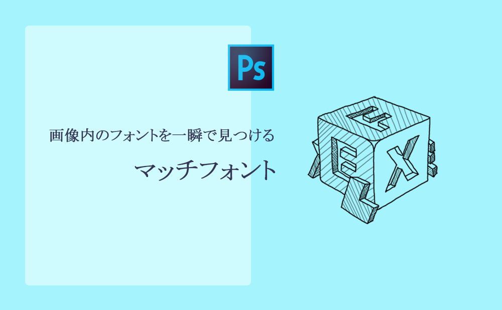

## 作業手順

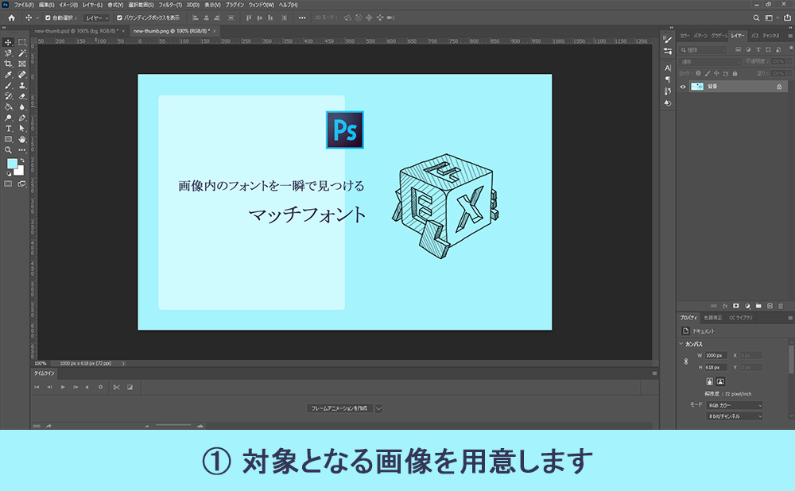

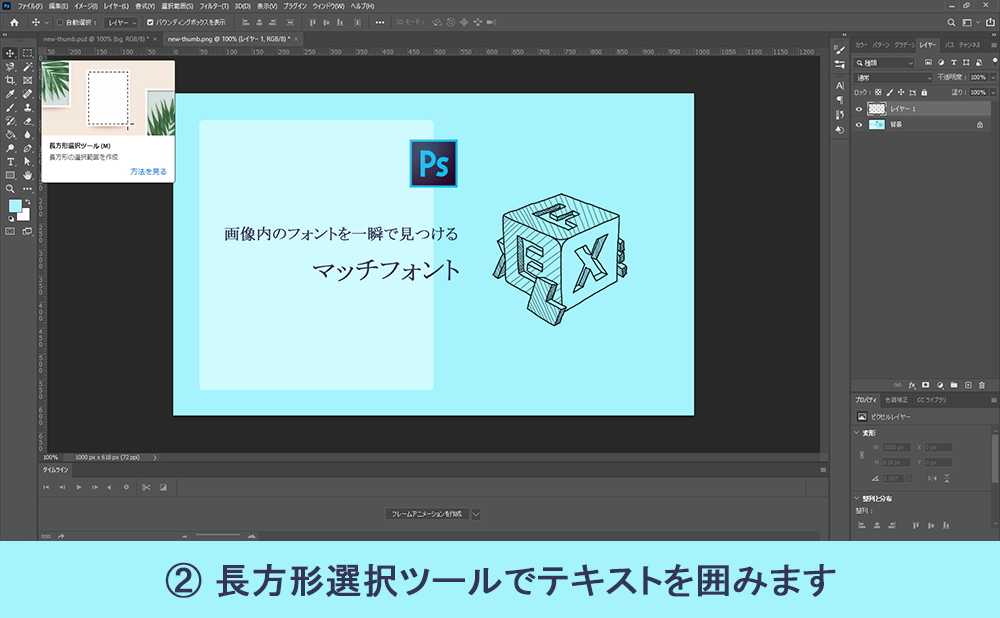

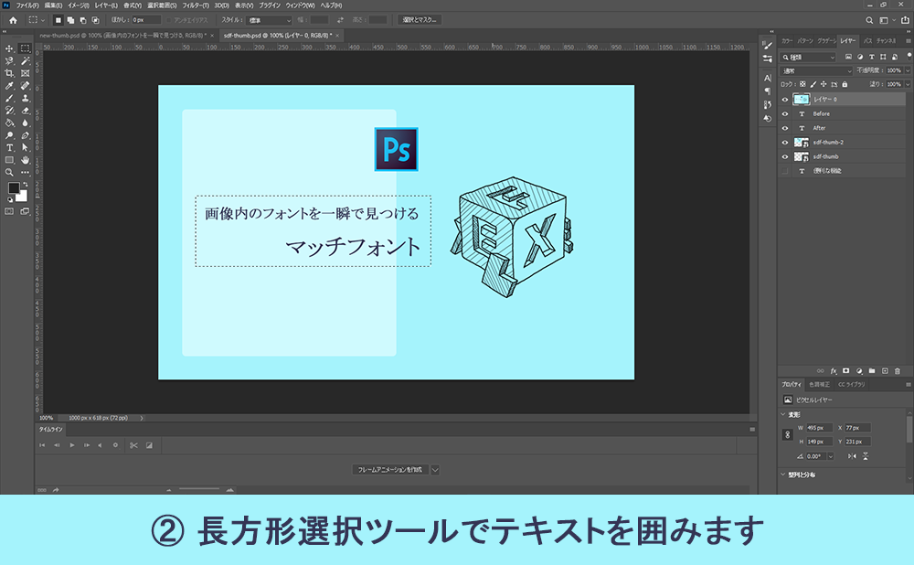

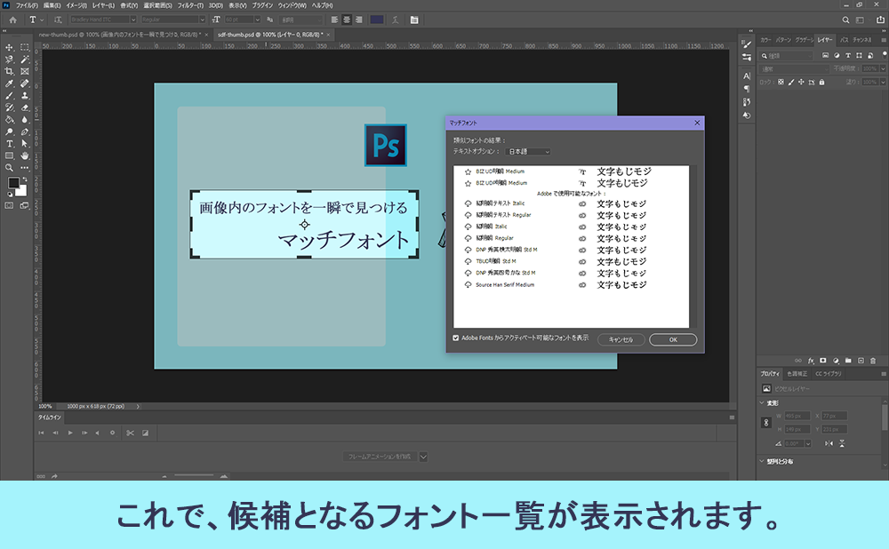

このように、とても簡単に候補となるフォント一覧が割り出せました。

**応用編**

ただ、候補がいくつかある中で結局どのフォントが正しいのかわからない場合、新規でテキストのレイヤーを用意し、そのレイヤー上でマッチフォントを使うと候補で上がったフォント、新規レイヤーで用意したテキストが同時に変換できてわかり易くなります。

例として、この記事のサムネイル画像内に、新しくテキストを追加してみます。  
手順は先程と殆ど変わらないので、以下図で作業手順を解説していきます。

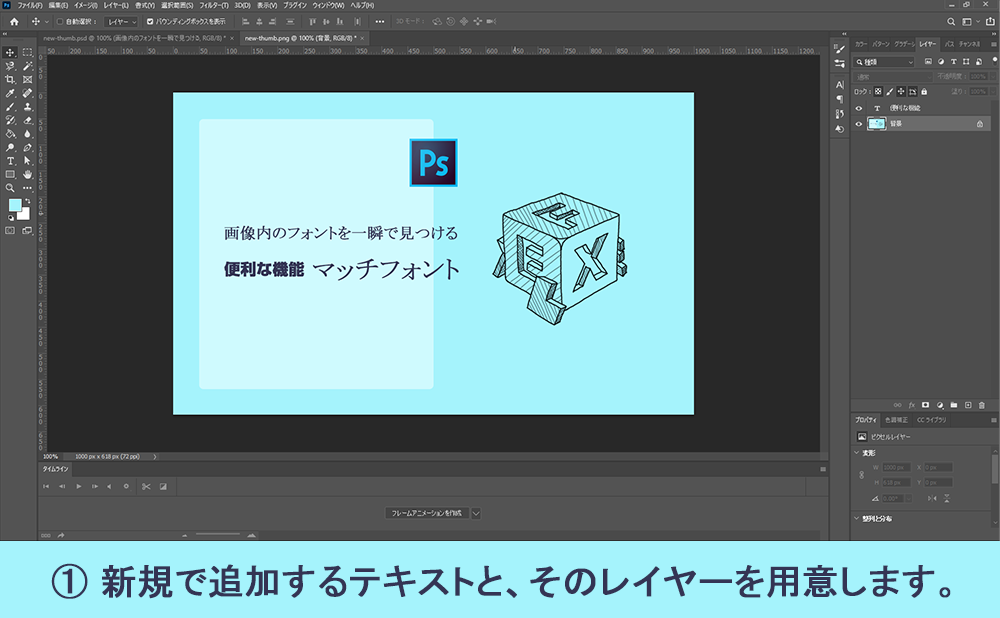

今回「マッチフォント」の左側に、「便利な機能」という文言を追加しました。

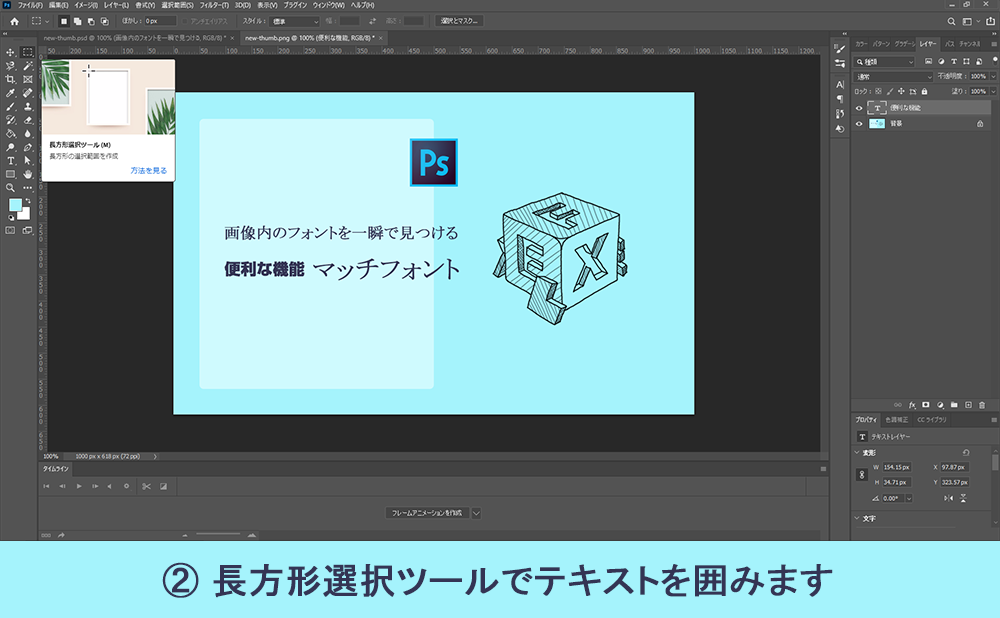

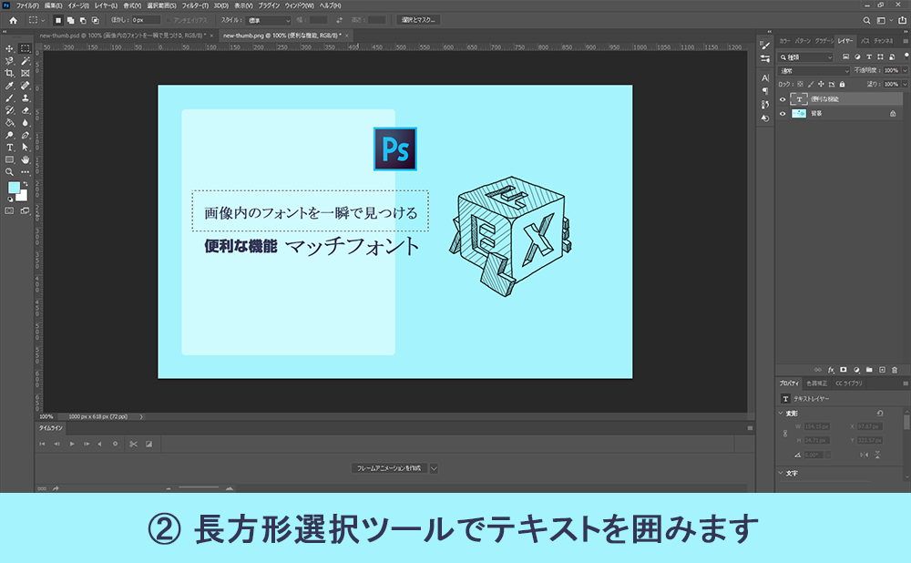

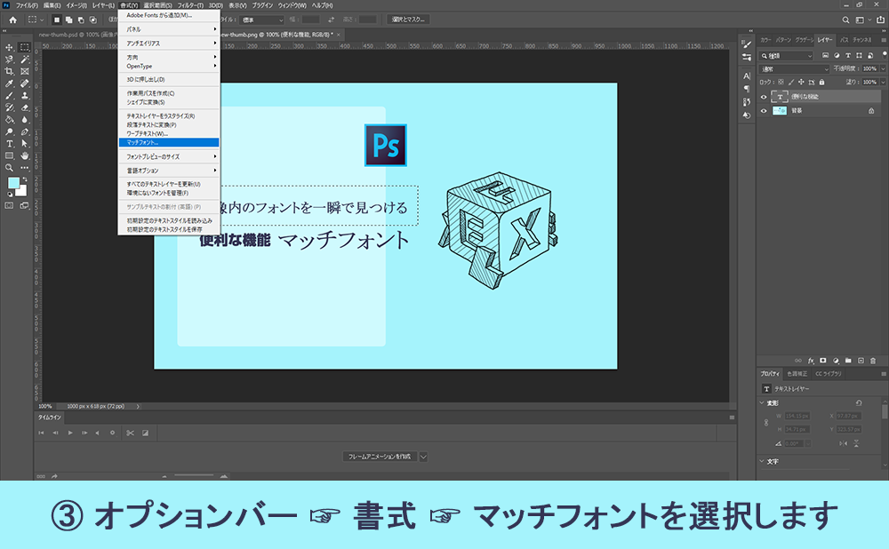

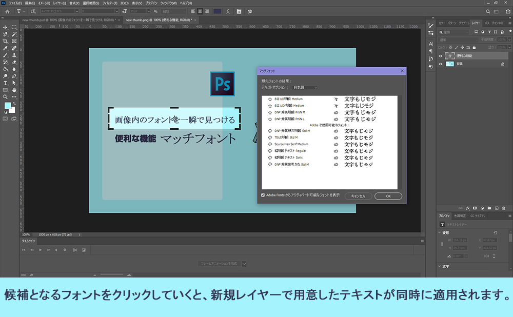

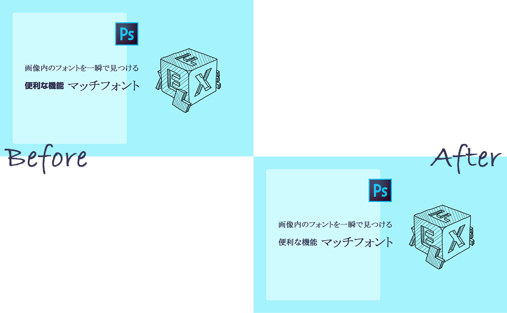

このように Photoshop のマッチフォントを使うことで、画像内で使われているフォントの種類を判別し、新しく文言を追加する場面でも同じフォントを使用し、違和感なく追加する事ができました。

## まとめ

Photoshop は沢山の機能があり、一つずつ覚えて使いこなすのは時間がかかると思いますがしっかり身に付けていきましょう！

- <a href="//af.moshimo.com/af/c/click?a_id=2698789&p_id=2842&pc_id=6482&pl_id=36330&url=https%3A%2F%2Fonline.dhw.co.jp%2Fcourse%2Fadobe%2F" rel="nofollow" referrerpolicy="no-referrer-when-downgrade">Adobe（アドビ）マスター講座 ｜デジタルハリウッド</a>

