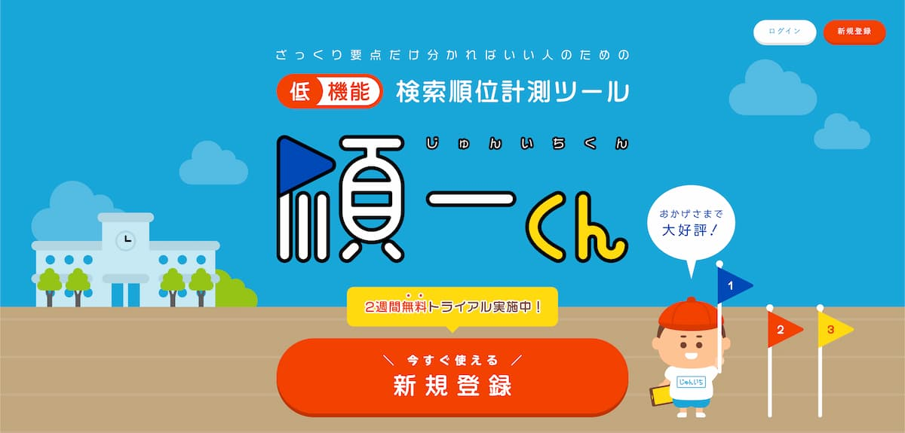

RankTracker, ahrefs, GRC 等、SEO 対策ツールというものはいくつかありますが、どのツールを扱うにしてもとりあえず利用料金が高いものです。

少し前から SEO の知識が必要になってきたので、他のサイトを運用しつつ学習しているんですが、やはりサーチコンソールやアナリティクスだけでは色々と足りない要素があります。

ましてや私のような SEO 初心者はどのツールは何ができて何ができないのか、またはその違いを言われてもあまりピンときません。

私のような初心者の方に最適な SEO ツールとして今回、手軽に導入できる月額利用料金 500 円の順一くんについて紹介します。

## 順一くんとは？

公式サイト：[順一くん](https://jun1kun.com/)

順一くんとは、簡単に説明すると凄くシンプルで検索順位のみを調べる SEO ツールです。  
RancTracker や ahrefs 等のような複雑な管理画面や設定をする必要は一切なく、順位を調べたいサイトの URL・キーワードを入力するだけで利用できます。

## 順一くんのメリット

- すごくシンプルな UI・超シンプル
- 月額 500 円で利用できる
- Web アプリケーション上で利用できるので、スマホ・PC どちらでも使える

## 順一くんのデメリット

- 測定できる検索エンジンは Google のみ
- キーワード数は、サイト数に限らず 50 まで（以上は追加料金）

## 使った感想

Web アプリケーション上で利用できるので非常に便利だと思ったのと、対策するキーワードが明確に決まっていている方には出先でもサクッと確認できるのでいいのかななんて思いました。（リアルタイムではなく、一日一回の計測らしいです）

---

つい最近まで A8 に広告があったような気がしてましたが、ありませんでした。とりあえず無料で 2 週間利用できるので、気になる方はぜひチェックしてみて下さい。

公式サイト：[順一くん](https://jun1kun.com/)
