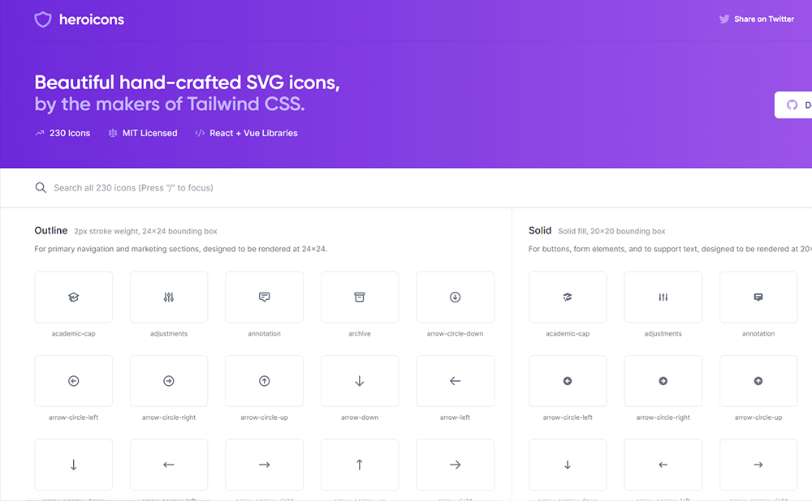

## はじめに

Tailwind CSS を使う際に便利な UI コンポーネントや UI キット等の参考サイトまとめました。

- Tailwind CSS

## UI 系

- Tailwind UI

Tailwind CSS 公式が作成している UI コンポーネント。  
ランディングページのヒーロー、機能セクション、ニュースレターの登録フォームなど、美しいデザインで作られた 400 種類以上のコンポーネントが用意されています。  
一部無料で使用できますが、本格的に使いたいとなると有料プランに入る必要があります。  
有料プランが気になる方は、[Tailwind CSS Pricing](https://tailwindui.com/pricing) をご覧ください。

---

- daisyUI

npm でパッケージが公開されている Tawilwind CSS で作られた UI コンポーネント。  
Bootstrap の `class="btn btn-primary"` のような形で daisyUI が定義しているのが特徴です。  
Tailwind CSS はベタがきで HTML を書いていくサイトには合わない印象ですが、これなら活用できるかもしれません。  
10 種類のテーマが用意されていて、それぞれデザインも素敵で可愛らしい印象です。

---

- headless UI

npm でパッケージが公開されている Tawilwind CSS で作られた UI コンポーネント。  
React や Vue を使う前提でコンポーネントが用意されており、 Web アプリケーションを構築していく際に使うと便利だと思います。

---

- [Lofi UI](https://lofiui.co/)

約 40 種類の UI コンポーネントが閲覧でき、ソースコードは [CodePen](https://codepen.io/) で公開されています。

---

- Kometa UI Kit

約 130 種類以上の HTML、Vue、React で使用できる UI コンポーネントが用意されています。

---

- Vechai UI

npm でパッケージが公開されている Tawilwind CSS で作られた UI コンポーネント。  
Preact cli, Next.js, Gatsby, およびその他の環境で使用できる UI コンポーネントが用意されています。

---

- Supabase UI

npm でパッケージが公開されている Tawilwind CSS と AntDesign に触発された UI コンポーネント。

⚠️ Supabase UI は現在ベータ版で、本番環境に対応していません

---

- Windmill UI

npm でパッケージが公開されている Tawilwind CSS で作られた UI コンポーネント。  
主に、React を使用する前提で UI コンポーネントが作られています。

---

- Meraki UI

約 60 種類のデザインが美しい Tailwind CSS で作られた UI コンポーネント。  
ダークモードにも対応しています。

---

- [TAILBLOCKS](https://tailblocks.cc/)

Web サイトを構築する際に、便利な Tailwind CSS で作られた UI コンポーネント。  
当サイトのフッターエリアは [TAILBLOCKS](https://tailblocks.cc/) のコンポーネントを利用しました。

---

- Tail-kit

約 250 種類の React、Vue、Angular で使用できるコンポーネント が用意されています。

---

- Tailwind Toolbox

UI テンプレートや、使うと便利なジェネレータ、ツールなどが掲載されているサイト。

---

- Tailwind Templates

数は少ないですが、Tailwind CSS で作られたテンプレートが用意されています。

---

- tailwindcompontnes

Tailwind CSS で作られたテンプレートサイトや UI コンポーネントが用意されています。  
これまでとは少し変わった、ユーザー投稿型の参考サイトです。

---

- Treact

Tailwind CSS を使用して構築された、React 用のテンプレートサイトです。  
約 50 種類の UI コンポートと、7 つのランディングページが用意されています。

---

- wickedblocks

約 130 種類の Tailwind CSS で作られた UI コンポーネントが用意されています。

---

- TailwindCSS Buttons

【コピペで使える！CSS のボタンデザイン】系の Tailwind CSS バージョンです。

## SVG 系

- heroicons

SVG アイコン。  
当ブログの SVG アイコンは全て [heroicons](https://heroicons.com/) を使用しています。

---

- hero-patterns

SVG 背景パターン。  
とてもおしゃれな背景パターンが用意されています。

## その他

- VSCode の拡張機能

