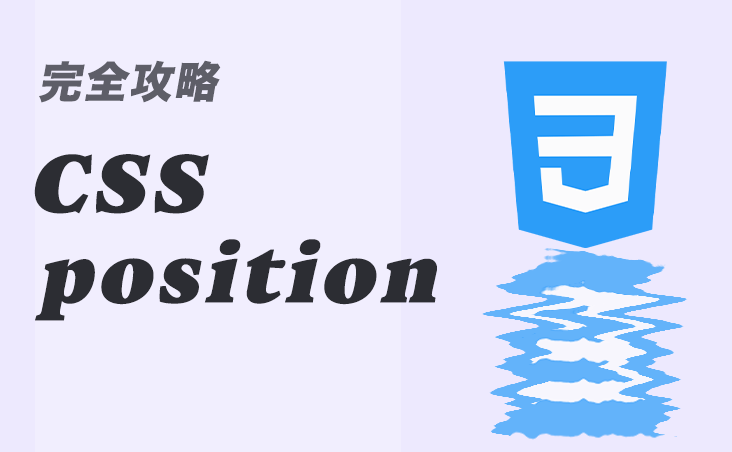

デザイナーの方や Web 制作をしている方は、Web ページを作成している際、CSS で特定の文章や構造を中央寄せにしたい！という場面って多々あるかと思います。

そんな時に使える、あらゆるパターンの中央揃えを紹介していきたいと思います。

## テキスト行の中央寄せ

テキストなどの **インライン要素** を中央寄せする場合は `text-align: center;` を使用します。

デフォルトだと背景色が白色でわかりずらいので、中央寄せできているかを視覚的に分かりやすくする為、背景に色つけて実装します。

```html:title=HTML
<h1 class="title">H1タイトル</h1>
```

```css{2}:title=CSS
.title {
	text-align: center;
	background-color: darksalmon; /* 背景色の指定 */
}
```

**実際の表示**


## ブロック要素の中央寄せ

Web サイト全体の横幅の指定する際によく使用します。  
使い方は、`width: 〇〇px;` を指定して、 `margin: 0 auto;` で中央寄せする事ができます。

`width` を指定せず、`margin: 0 auto;` を指定しても中央寄せにならないので注意しましょう。
今回も中央寄せできているかを視覚的に分かりやすくする為、要素の高さを画面いっぱいにし、背景に色つけて実装します。

```html:title=HTML
<div class="wrapper">
	<!-- Webサイトの中身 -->
</div>
```

```css{2,3}:title=CSS
.wrapper {
	width: 1024px;
	margin: 0 auto;

	height: 100vh; /* 要素の高さを画面いっぱいにする指定 */
	background-color: darksalmon; /* 背景色の指定 */
}
```

**実際の表示**


## ブロック要素の上下中央寄せ

上下中央寄せしたいブロック要素の親要素に対して `display: flex;`, `align-items: center;`, `justify-content: center;` を指定します。

```html:title=HTML
<div class="wrapper">
	<div class="inner">
		<p>
			Lorem, ipsum dolor sit amet consectetur adipisicing elit. Tempore
			consequatur modi, beatae at, facilis aspernatur totam similique ipsum
			soluta hic error ea placeat corporis amet eum minima? Magnam, excepturi
			incidunt.
		</p>
	</div>
</div>
```

```css{2,3,4}:title=CSS
.wrapper {
	display: flex;
	align-items: center;
	justify-content: center;
}

/* 視覚的に分かりやすいようにする為のCSS */
.inner {
	background-color: darksalmon;
	width: 400px;
	padding: 8px;
}
```

**実際の表示**


## 絶対値の上下中央寄せ

絶対値 `position` を指定して CSS を記述する際、基本的には親要素に `position: relative;` 、子要素（もしくは擬似要素）に対して `position: absolute;` を使用します。

このように指定して子要素の位置を移動させる際、`top, left, right, bottom` を使用して要素の配置をしますが、`top: 50%; left: 50%;`としただけでは上下中央配置にはならず、少し右下にズレてしまいますので、それを解消できるテクニックを紹介します。

```html:title=HTML
<div class="wrapper">
	<span class="inner"></span>
</div>
```

```css{2,10-13}:title=CSS
.wrapper {
	position: relative;
	/* 視覚的に分かりやすいようにする為のCSS */
	width: 300px;
	height: 300px;
	margin: 0 auto;
	background-color: darksalmon;
}
.inner {
	position: absolute;
	top: 50%;
	left: 50%;
	transform: translate(-50%, -50%);
	/* 視覚的に分かりやすいようにする為のCSS */
	display: inline-block;
	width: 30px;
	height: 30px;
	border-radius: 50%;
	background-color: #444;
}
```

**実際の表示**



## まとめ

CSS で中央寄せする方法は今回紹介した方法以外にもありますが、実際によく使用する以下 4 つの例を紹介しました。

1. テキスト行（インライン要素）の中央寄せ
1. ブロック要素の中央寄せ
1. ブロック要素の上下中央寄せ
1. 絶対値の上下中央寄せ

この記事で紹介した CSS の指定方法は頻繁に使用し、かつ便利なので覚えとくと実際の業務でもしっかり役に立つと思います！
