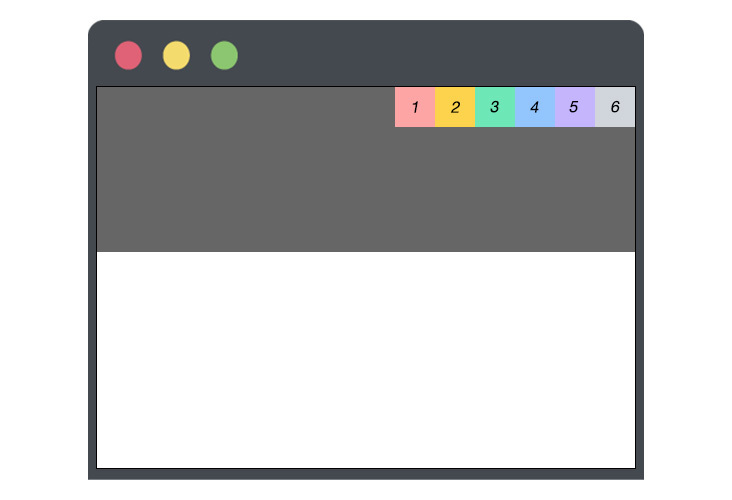
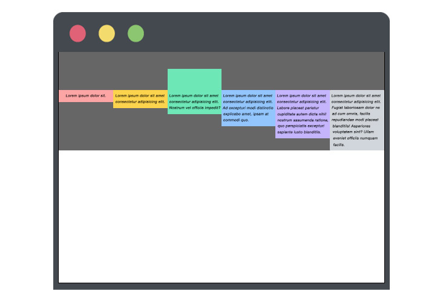

## はじめに

この記事では CSS の flexbox に関する知識を、基礎から徹底解説していきます。

この flexbox を理解する上で必要なポイントはたったの**2 つ**だけです。  
それぞれどこがポイントなのかの詳細は後述しますが、その 2 つというのは **コンテナ要素** と **アイテム要素** この **2 つ**だけです。

この 2 つの要素それぞれの役割さえ理解することができれば、flexbox を使い自分の思い通りにレイアウトを構築していく事が可能になります。

## CSS flexbox とは

flexbox とは CSS の**レイアウトモジュール**です。  
モジュールとは機能を持つ要素（かたまり）のことです。なので、レイアウトモジュールというとレイアウトの機能を持つ要素と考えることができます。

以下のように複数の要素を横並びにしたり、各デバイスの画面幅によって要素の並び順を変更できるなど、少ないコード量で多彩な表現がかんたんにできます。


## flexbox の基礎

冒頭で少し触れましたが、 flexbox は**コンテナ要素**（親要素）と**アイテム要素**（子要素）という 2 つの要素によりレイアウトを構成します。考え方としては、以下の図を参照下さい。


今回はこのコンテナ要素（親要素）に焦点を当て、指定できるプロパティやその値について徹底的に解説していきます。

---

今回の解説に使用するコードは下記になります。

```html:title=解説用のHTMLコード
<div class="container">
	<div class="item-1">1</div>
	<div class="item-2">2</div>
	<div class="item-3">3</div>
</div>
```

```css:title=解説用のCSSコード
/* アイテム要素に適用するCSS */
.container div {
	text-align: center;
	width: 100%;
}
.item-1 {
	background-color: #fca5a5;
}
.item-2 {
	background-color: #fcd34d;
}
.item-3 {
	background-color: #6ee7b7;
}
```

**現在の表示**


## flexbox の使い方

flexbox を使って上記のように縦積みになっている要素を横並びにする方法は非常にシンプルで、**コンテナ要素**（親要素）に対して、`display: flex;` を指定するだけになります。

```css{2-4}:title=親要素に指定しているCSSに注目
/* 親要素 */
.container {
	display: flex;
}
/* 子要素 */
.container div {
	text-align: center;
	width: 100%;
}
.item-1 {
	background-color: #fca5a5;
}
.item-2 {
	background-color: #fcd34d;
}
.item-3 {
	background-color: #6ee7b7;
}
```


このように**コンテナ要素（親要素）**に対して `display: flex;` を指定するだけでアイテム要素（子要素）を横並びにする事ができます。  
それでは、コンテナ要素に対して指定できるプロパティとその値について詳しく解説していきます。

## コンテナ要素の初期値

現段階でまったくわからなくても問題ありません。  
ハイライトの箇所は、コンテナ要素に対して `display: flex;` を指定した際、その裏側では初期値として振られているのが以下のプロパティとその値です。

```css{4-8}:title=コンテナ要素の初期値
.container {
	display: flex;
	/* display: flex; を指定した際、初期値として振られている値 */
	flex-direction: row;
	align-items: stretch;
	justify-content: flex-start;
	flex-wrap: nowrap;
	align-content: stretch;
}
```

flexbox を理解し使いこなすコツとしては、これら初期値の値をふんわりとでもいいので頭に入れておくことです。

CSS のコード上だと `display: flex;` しか指定されていないので、自分の思い通りのレイアウトが組めない時には初期値の値を確認してそのレイアウトに対して適切な値がないか調べて実装していくのがコツになります。

それでは次の章から解説していきます。

## flex-direction

`flex-direction` は、指定する値によってアイテム要素の方向を指定できたり、アイテム要素の並び順を反転させたりする事ができるプロパティです。

1. `flex-direction: row;`（初期値：横並びになる）
1. `flex-direction: row-reverse;`（アイテム要素の順序を反転）
1. `flex-direction: column;`（縦に積み重なる）
1. `flex-direction: column-reverse;`（アイテム要素の順序を反転）

---

**①** `flex-direction: row;`（初期値：横並びになる）

[コンテナ要素の初期値](#コンテナ要素の初期値) の章で紹介したコンテナ要素のデフォルトの値になります。  
指定しなくてもうごきに変化はありません。

```css{3}
.container {
	display: flex;
	flex-direction: row;
}
```


---

**②** `flex-direction: row-reverse;`（アイテム要素の順序を反転）

① の `row` ではアイテム要素が右から左に向けて横並びになっていましたが、`row-reverse` はそのアイテム要素の順序を反転させる事ができます。

```css{3}
.container {
	display: flex;
	flex-direction: row-reverse;
}
```


---

**③** `flex-direction: column;`（縦に積み重なる）

`flex-direction: column;` は、アイテム要素を縦積みに配置します。  
見た目だけだと `display: flex;` を指定する前と変化がありませんが、これは `display: flex;` が効いていない訳ではなくあえて指定しています。

```css{3}
.container {
	display: flex;
	flex-direction: column;
}
```


この `flex-direction: column;` 、一見するとうごきに変化がなく意味が感じられないかと思いますが、レスポンシブ対応する際にその恩恵を受けることができます。

どういうことかといいますと、PC デバイスで閲覧している際は `display: flex;`（アイテム要素の横並び） を指定し、スマホやタブレットデバイスで閲覧している時は横並びではなく、縦積みにしたい！という場面は頻繁に出てくるかと思います。その際に `flex-direction: column;` （アイテム要素をたて積み）を使用する事で、レスポンシブ対応をかんたんにできます。

```css{9}
/* PCデバイスで閲覧している際の指定 */
.container {
	display: flex;
}

/* デバイスのサイズが768px以下の場合に適用 */
@media (max-width: 768px) {
  .container {
    flex-direction: column;
  }
}
```


---

**④** `flex-direction: column-reverse;`（アイテム要素の順序を反転）

上記の ③ で解説した、`column` のようにアイテム要素を縦積みに配置し、さらにそのアイテム要素の順序を反転させる事ができます。

```css{3}
.container {
	display: flex;
	flex-direction: column-reverse;
}
```


この使い方は Web サイトのデザインにもよりますが、色々な場面で使えるので頭に入れておくとよいでしょう。

## flex-wrap

`flex-wrap` は、アイテム要素を 1 行で配置するか、またはアイテム要素を途中で折り返し複数行で表示するかを指定できるプロパティです。

1. `flex-wrap: nowrap;`（初期値：アイテム要素を折り返さない）
1. `flex-wrap: wrap;`（アイテム要素の折り返しを指定できる）
1. `flex-wrap: wrap-reverse;`（アイテム要素の順序を反転）

折り返しの解説はアイテム要素（子要素）が多い方が理解しやすいので、解説用コードを少し変更します。

```html{5-7}:title=アイテム要素4,5,6を追加
<div class="container">
	<div class="item-1">1</div>
	<div class="item-2">2</div>
	<div class="item-3">3</div>
	<div class="item-4">4</div>
	<div class="item-5">5</div>
	<div class="item-6">6</div>
</div>
```

```css{18-26}
.container {
	display: flex;
}
/* 子要素に適用するCSS */
.container div {
	text-align: center;
	width: 100%;
}
.item-1 {
	background-color: #fca5a5;
}
.item-2 {
	background-color: #fcd34d;
}
.item-3 {
	background-color: #6ee7b7;
}
.item-4 {
	background-color: #93c5fd;
}
.item-5 {
	background-color: #c4b5fd;
}
.item-6 {
	background-color: #d1d5db;
}
```

**現在の表示**


---

**①** `flex-wrap: nowrap;`（初期値：アイテム要素を折り返さない）

[コンテナ要素の初期値](#コンテナ要素の初期値) の章で紹介したコンテナ要素のデフォルトの値になります。  
指定しなくてもうごきに変化はありません。  
`nowrap` とは **子要素を折り返さない** というデフォルトの値で子要素が途中で折り返す事なく一定の方向に押し込まれます。

```css{3}
.container {
	display: flex;
	flex-wrap: nowrap;
}
```


---

**②** `flex-wrap: wrap;`（アイテム要素の折り返しを指定できる）

`flex-wrap: wrap;` を使用することで、アイテム要素（子要素）の折り返し地点を指定できるようになります。  
一度、現状の解説用コードに `flex-wrap: wrap;` を指定し、その挙動を確認してみます。

```css{3}
.container {
	display: flex;
	flex-wrap: wrap;
}
```


このように、全てのアイテム要素が縦積みになっているのがわかるかと思います。

なぜこうなるかといいますと、解説用コードの CSS ではすべてのアイテム要素に `width: 100%;` という指定をしているからです。

つまり、この段階ではアイテム要素の折り返しの指定は `width: 100%;` （アイテム要素毎の折り返し）ですので、このように縦積みになるという事です。

```css{3,8}:title=現段階のアイテム要素の横幅指定に注目
.container {
	display: flex;
	flex-wrap: wrap;
}
/* 子要素に適用するCSS */
.container div {
	text-align: center;
	width: 100%;
}
```

では、6 つあるアイテム要素の `width` の指定を変更して、各アイテム要素の折り返しを指定してみます。

```css{8}:title=すベてのアイテム要素の横幅を1/3に指定
.container {
	display: flex;
	flex-wrap: wrap;
}
/* 子要素に適用するCSS */
.container div {
	text-align: center;
	width: calc(100% / 3);
}
```


```css{8}:title=すベてのアイテム要素の横幅を1/4に指定
.container {
	display: flex;
	flex-wrap: wrap;
}
/* 子要素に適用するCSS */
.container div {
	text-align: center;
	width: calc(100% / 4);
}
```


このように、`flex-wrap: wrap;` を指定することでアイテム要素の折り返しをかんたんに指定でき、複雑なレイアウトを構築していく事が可能になります。

---

**③** `flex-wrap: wrap-reverse;`（アイテム要素の順序を反転）

上記の ② で解説した、`wrap` のようにアイテム要素の折り返しを指定でき、さらにそのアイテム要素の順序を反転させる事ができます。

```css{3,8}:title=すべてのアイテム要素の横幅を1/3に指定
.container {
	display: flex;
	flex-wrap: wrap-reverse;
}
/* 子要素に適用するCSS */
.container div {
	text-align: center;
	width: calc(100% / 3);
}
```


```css{3,8}:title=すべてのアイテム要素の横幅を1/4に指定
.container {
	display: flex;
	flex-wrap: wrap-reverse;
}
/* 子要素に適用するCSS */
.container div {
	text-align: center;
	width: calc(100% / 4);
}
```


## flex-flow

こちらのプロパティは先程解説した `flex-direction` と `flex-wrap` を一括で指定することができる、ショートハンドプロパティです。

`flex-flow` に関しては独自の構成があるわけではなくショートハンドプロパティとして、`flex-flow: row wrap` のように二つのプロパティ同時に指定できるようになります。

```css{4,5,10}:title=下記2つのコードは、レイアウト上でうごきの変化はありません
/* 省略しない書き方 */
.container {
	display: flex;
	flex-direction: row;
	flex-wrap: wrap;
}
/* 省略した書き方 */
.container {
	display: flex;
	flex-flow: row wrap;
}
```

こちらは初めから使おうとせず、`flex-direction` と `flex-wrap` に慣れてから使っていくのがおすすめです。

## justify-content

`justify-content` は、アイテム要素の水平ラインの配置や、各アイテム要素の間隔を指定できます。

1. `justify-content: flex-start;`（初期値：アイテム要素を先頭に寄せる）
1. `justify-content: center;`（アイテム要素を中央に寄せる）
1. `justify-content: flex-end;`（アイテム要素を末尾に寄せる）
1. `justify-content: space-between;`（④ で詳しく解説します）
1. `justify-content: space-around;`（⑤ で詳しく解説します）
1. `justify-content: space-evenly;`（⑥ で詳しく解説します）

---

こちらの章の解説から CSS コードを少し変更して解説していきます。  
HTML コードは変更ありませんので、引き続きこれまでと同じコードを利用していきます。

- コンテナ要素（親要素）に高さと背景色を追加
- アイテム要素（子要素）に横幅と高さを追加

```css{2,3,9-11}:title=CSS
.container {
	height: 360px;
	background-color: #666;
	display: flex;
}

.container div {
	text-align: center;
	width: 48px;
	height: 48px;
	line-height: 48px;
}

.item-1 {
	background-color: #fca5a5;
}
.item-2 {
	background-color: #fcd34d;
}
.item-3 {
	background-color: #6ee7b7;
}
.item-4 {
	background-color: #93c5fd;
}
.item-5 {
	background-color: #c4b5fd;
}
.item-6 {
	background-color: #d1d5db;
}
```

**現在の表示**


---

**補足**

`height` と `line-height` に同じ値を使用することでインライン要素の中央寄せができます。  
こちらについて詳しく知りたい方は以下の記事をチェックしてみてください。

[もう迷わない！役に立つ CSS 中央寄せ 5 選](../css-center-reference/)

---

**①** `justify-content: flex-start;`（初期値：アイテム要素を先頭に寄せる）

[コンテナ要素の初期値](#コンテナ要素の初期値) の章で紹介したコンテナ要素のデフォルトの値になります。  
指定しなくてもうごきに変化はありません。

```css{5}:title=初期値
.container {
	height: 360px;
	background-color: #666;
	display: flex;
	justify-content: flex-start;
}
```


---

**②** `justify-content: center;`（アイテム要素を中央に寄せる）

アイテム要素を中央寄せにする事ができます。

```css{5}:title=アイテム要素を中央寄せ
.container {
	height: 360px;
	background-color: #666;
	display: flex;
	justify-content: center;
}
```


---

**③** `justify-content: flex-end;`（アイテム要素を末尾に寄せる）

アイテム要素を右寄せにする事ができます。

```css{5}:title=アイテム要素を右寄せ
.container {
	height: 360px;
	background-color: #666;
	display: flex;
	justify-content: flex-end;
}
```



---

**④** `justify-content: space-between;`

`justify-content: space-between;` はアイテム要素の先頭・末尾の要素はコンテナ要素にピッタリくっつき、それ以外のアイテム要素の余白を均等に配置する値です。詳しくは図で解説していきます。

```css{5}
.container {
	height: 360px;
	background-color: #666;
	display: flex;
	justify-content: space-between;
}
```


---

**⑤** `justify-content: space-around;`

`justify-content: space-around;` はアイテム要素の余白を均等にし、先頭・末尾の要素はコンテナ要素との間に各アイテム要素の半分の余白を配置する値です。こちらも詳しくは図で解説していきます。

```css{5}
.container {
	height: 360px;
	background-color: #666;
	display: flex;
	justify-content: space-around;
}
```


このように両端の余白は、**各アイテム要素の半分の余白** が設けられます。

---

**⑥** `justify-content: space-evenly;`

`justify-content: space-evenly;` は全てのアイテム要素の余白が均等に配置される値です。  
こちらの値は先程の `justify-content: space-between;` や `justify-content: space-around;` と比べると直感的に理解できるかと思います。

```css{5}
.container {
	height: 360px;
	background-color: #666;
	display: flex;
	justify-content: space-evenly;
}
```


## align-items

`align-items` は、アイテム要素の垂直ラインの配置を指定できます。

1. `align-items: stretch;`（初期値：アイテム要素の上下の高さを揃える）
1. `align-items: flex-start;`（アイテム要素を先頭に寄せる）
1. `align-items: center;`（アイテム要素を中央に寄せる）
1. `align-items: flex-end;`（アイテム要素を末尾に寄せる）
1. `align-items: baseline;`（アイテム要素のテキストのベースラインの位置を合わせる）

---

こちらの章ではアイテム要素の文字数が各要素で差がある方がわかりやすいので、HTML コードを変更します。

```html:title=HTML
<div class="container">
	<div class="item-1">Lorem ipsum dolor sit.</div>
	<div class="item-2">
		Lorem ipsum dolor sit amet consectetur adipisicing elit.
	</div>
	<div class="item-3">
		Lorem ipsum dolor sit amet consectetur, adipisicing elit. Nostrum vel
		officiis impedit?
	</div>
	<div class="item-4">
		Lorem ipsum dolor sit amet consectetur adipisicing elit. Ad excepturi modi
		distinctio explicabo amet, ipsam at commodi quo.
	</div>
	<div class="item-5">
		Lorem ipsum dolor sit amet consectetur adipisicing elit. Labore placeat
		pariatur cupiditate autem dicta nihil nostrum assumenda ratione, quo
		perspiciatis excepturi sapiente iusto blanditiis.
	</div>
	<div class="item-6">
		Lorem ipsum dolor sit amet consectetur adipisicing elit. Fugiat laboriosam
		dolor nemo ad cum omnis, facilis repudiandae modi placeat blanditiis!
		Asperiores voluptatem debitis sint? Ullam eveniet officiis numquam cum
		facilis.
	</div>
</div>
```

CSS のコードも、高さの指定を取るなど少し変更した箇所があるので、その差分を記載します。  
コメントされている箇所は削除したコードで、ハイライトが当たっている箇所が追加した CSS になります。

```css{8}:title=CSSの変更差分
.container {
	/* height: 360px; */
	background-color: #666;
	display: flex;
}

.container div {
	width: 100%;
	/* text-align: center; */
	/* width: 48px; */
	/* height: 48px; */
	/* line-height: 48px; */
}

.item-1 {
	background-color: #fca5a5;
}
.item-2 {
	background-color: #fcd34d;
}
.item-3 {
	background-color: #6ee7b7;
}
.item-4 {
	background-color: #93c5fd;
}
.item-5 {
	background-color: #c4b5fd;
}
.item-6 {
	background-color: #d1d5db;
}
```

**現在の表示**


---

**①** `align-items: stretch;`（初期値：アイテム要素の上下の高さを揃える）

[コンテナ要素の初期値](#コンテナ要素の初期値) の章で紹介したコンテナ要素のデフォルトの値になります。  
各アイテム要素の文字数はそれぞれ違いますが、高さは統一されているのがわかります。

```css{4}
.container {
	background-color: #666;
	display: flex;
	align-items: stretch;
}
```


---

**②** `align-items: flex-start;`（アイテム要素を先頭に寄せる）

`align-items: flex-start;` はアイテム要素の高さが各要素の高さで表示され、先頭に寄せます。

```css{4}
.container {
	background-color: #666;
	display: flex;
	align-items: flex-start;
}
```


---

**③** `align-items: center;`（アイテム要素を中央に寄せる）

`align-items: center;` はアイテム要素の高さが各要素の高さで表示され、中央に寄せます。


---

**④** `align-items: flex-end;`（アイテム要素を末尾に寄せる）

`align-items: flex-end;` はアイテム要素の高さが各要素の高さで表示され、末尾に寄せます。

```css{4}
.container {
	background-color: #666;
	display: flex;
	align-items: flex-end;
}
```


---

**⑤** `align-items: baseline;`（アイテム要素のテキストのベースラインの位置を合わせる）

`align-items: baseline;` はアイテム要素の高さが各要素の高さで表示され、テキストのベースラインの位置を合わせます。  
詳しくは図で解説していきます。

一度、`align-items: baseline;` を指定してその挙動を確認していきます。

```css{4}
.container {
	background-color: #666;
	display: flex;
	align-items: baseline;
}
```


これだと先程解説した **②** `align-items: flex-start;` と同では？と思うかもしれません。  
これは、各アイテム要素には現在、CSS で背景色の指定しかされていなくどの要素にも `padding` や `margin` などの指定が無いためです。

`align-items: baseline;` の挙動を知るために、左から 3 つめの緑色のアイテム要素に対して `padding` と `margin` の指定をしてみます。

```css{3,4}:title=緑色のアイテム要素にのみ余白を指定
.item-3 {
	background-color: #6ee7b7;
	margin-top: 48px;
	padding-top: 100px;
}
```



このように、余白を指定したアイテム要素のテキストのベースラインを基準に他のアイテム要素も綺麗に並んでいるのがわかります。


## align-content

`align-content` は、アイテム要素の垂直ラインの配置や、各アイテム要素の間隔を指定できます。

1. `align-content: stretch;`（初期値：① で詳しく解説します）
1. `align-content: flex-start;`（アイテム要素を先頭に寄せる）
1. `align-content: center;`（アイテム要素を中央に寄せる）
1. `align-content: flex-end;`（アイテム要素を末尾に寄せる）
1. `align-content: space-between;`（⑤ で詳しく解説します）
1. `align-content: space-around;`（⑥ で詳しく解説します）
1. `align-content: space-evenly;`（⑦ で詳しく解説します）

---

**`aligin-content` の考え方**

先程紹介した `justify-content` とプロパティ名が少し似ているのに気づくかと思います。

`justify-content` はアイテム要素の横軸に影響するプロパティでした。これから解説する `align-content` はアイテム要素の縦軸に影響するプロパティで、それぞれ指定できる値は共通のものが多いです。

値の数が少し多く感じますが、初期値の `align-contenet: stretch;` 以外は `justify-content` と同じ値になっていて、素直に `justify-content` の縦バージョンと考えると、すぐに習得できるものです。

---

こちらの章では CSS のコードを少し変更します。  
HTML のコードは上記で解説した [align-items](#code-classlanguage-textalign-itemscode) の章で使用したものをそのまま利用します。

CSS はコンテナ要素に高さを、アイテム要素に幅の指定を追加し、`align-content` はアイテム要素が複数行ある際に使用できるプロパティなので、`flex-wrap` を使用してアイテム要素を折り返す値を指定しています。

`flex-wrap: wrap` を忘れた方は 1 度 [flex-wrap](#code-classlanguage-textflex-wrapcode) の章に戻り、さっと確認してみてください。

```css{4,5,10}:title=CSSの変更差分
.container {
	background-color: #666;
	display: flex;
	height: 360px;
	flex-wrap: wrap;
}

.container div {
	/* width: 100%; */
	width: calc(100% / 3);
}
.item-1 {
	background-color: #fca5a5;
}
.item-2 {
	background-color: #fcd34d;
}
.item-3 {
	background-color: #6ee7b7;
}
.item-4 {
	background-color: #93c5fd;
}
.item-5 {
	background-color: #c4b5fd;
}
.item-6 {
	background-color: #d1d5db;
}
```

**現在の表示**


---

**①** `align-content: stretch;`（初期値）

[コンテナ要素の初期値](#コンテナ要素の初期値) の章で紹介したコンテナ要素のデフォルトの値になります。  
アイテム要素の高さが指定されていない際、アイテム要素はコンテナ要素の高さいっぱいに広がります。

```css{6}
.container {
	background-color: #666;
	display: flex;
	height: 360px;
	flex-wrap: wrap;
	align-content: stretch;
}
```


---

**②** `align-content: flex-start;`（アイテム要素を先頭に寄せる）

`align-content: flex-start;` はアイテム要素を先頭（コンテナ要素の上）に寄せます。

```css{6}
.container {
	background-color: #666;
	display: flex;
	height: 360px;
	flex-wrap: wrap;
	align-content: flex-start;
}
```


各アイテム要素の文字数が違っても、1 行目の 3 つのアイテム要素の高さは同じで、2 行目の 3 つのアイテム要素の高さも同じになっているのがわかります。

---

**③** `align-content: center;`（アイテム要素を中央に寄せる）

`align-content: center;` は、アイテム要素を中央に寄せます。

```css{6}
.container {
	background-color: #666;
	display: flex;
	height: 360px;
	flex-wrap: wrap;
	align-content: center;
}
```


---

**④** `align-content: flex-end;`（アイテム要素を末尾に寄せる）

`align-content: flex-end;` はアイテム要素を末尾（コンテナ要素の下）に寄せます。

```css{6}
.container {
	background-color: #666;
	display: flex;
	height: 360px;
	flex-wrap: wrap;
	align-content: flex-end;
}
```


---

①~④ の解説はアイテム要素が 2 行でしたが、残りの ⑤,⑥,⑦ はアイテム要素を 3 行にして解説していきます。  
理由としては、これから解説する値は行数が多い方が理解しやすい為になります。

```css{10}:title=アイテム要素の横幅を1/3から1/2に変更
.container {
	background-color: #666;
	display: flex;
	height: 360px;
	flex-wrap: wrap;
}

.container div {
	/* width: calc(100% / 3); */
	width: calc(100% / 2);
}
```

**現在の表示**


初期値だと `align-content: stretch;` が効いているのでアイテム要素に高さを指定しなくてもコンテナ要素いっぱいに広がっているのがわかります。

---

**⑤** `align-content: space-between;`

`align-content: space-between;` はアイテム要素の先頭・末尾の要素はコンテナ要素にピッタリくっつき、それ以外のアイテム要素の余白を均等に配置する値です。詳しくは図で解説していきます。

```css{6}
.container {
	background-color: #666;
	display: flex;
	height: 360px;
	flex-wrap: wrap;
	align-content: space-between;
}
```


いずれも `justify-content: space-between;` の縦バージョンと考えればすぐ理解できるようになります。

---

**⑥** `align-content: space-around;`

`align-content: space-around;` はアイテム要素の余白を均等にし、先頭・末尾の要素はコンテナ要素との間に各アイテム要素の半分の余白を配置する値です。こちらも詳しくは図で解説していきます。

```css{6}
.container {
	background-color: #666;
	display: flex;
	height: 360px;
	flex-wrap: wrap;
	align-content: space-around;
}
```


---

**⑦** `align-content: space-evenly;`

`align-content: space-evenly;` は全てのアイテム要素の余白が均等に配置される値です。  
こちらは直感的に理解しやすい値となっています。

```css{6}
.container {
	background-color: #666;
	display: flex;
	height: 360px;
	flex-wrap: wrap;
	align-content: space-evenly;
}
```


## まとめ

CSS flexbox のコンテナ要素に対して指定できるプロパティとその値について解説しました。

以前投稿した [もう迷わない！役に立つ CSS 中央寄せ 5 選](../css-center-reference/) の記事では、今回解説した **flexbox** のプロパティや値をうまく活用してレイアウトを構築している章もあるので、気になる方はチェックしてみてください。

次の記事では、CSS flexbox の **アイテム要素（子要素）** について指定できるプロパティやその値について基礎から解説したので、ぜひチェックしてみてください。


- 次の記事： [もう悩まない！基礎から学ぶ CSS flexbox （アイテム要素編）](../css-flex-box-item/)

## おすすめの記事

1. [基礎から学ぶ CSS flexbox （アイテム要素編）](../css-flex-box-item/)
1. [もう迷わない！役に立つ CSS 中央寄せ 5 選](../css-center-reference/)
