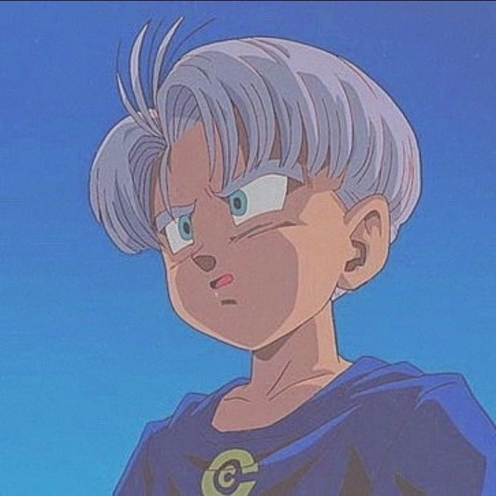

## h2

```jsx:title=src/gatsby.js
import React from "react";

const IndexPage = () => {
	return (
		<React.Fragment>
			<p>Hello Gatsby</p>
		</React.Fragment>
	);
};

export default IndexPage;
```


## h2 Gatsby

- list
- list
- list

---

1. Hello
1. Hello
1. Hello

## h2 見出し

> クライアントからの要望を元に Web サイト制作を担当。ディレクション、デザイン、制作を行い 3 名チームのチームリーダーを担当。
> <cite>gatsby</cite>

[google link](https://google.com)

[google link](https://google.com)

[google link](https://google.com)

| Head | Head | Head | Head | Head | Head |
| ---- | ---- | ---- | ---- | ---- | ---- |
| Text | Text | Text | Text | Text | Text |
| Text | Text | Text | Text | Text | Text |

## 見出し

クライアントからの要望を元に Web サイト制作を担当。ディレクション、デザイン、制作を行い 3 名チームのチームリーダーを担当。

クライアントからの要望を元に Web サイト制作を担当。ディレクション、デザイン、制作を行い 3 名チームのチームリーダーを担当。

## 見出し



> クライアントからの要望を元に Web サイト制作を担当。ディレクション、デザイン、制作を行い 3 名チームのチームリーダーを担当。
> クライアントからの要望を元に Web サイト制作を担当。ディレクション、デザイン、制作を行い 3 名チームのチームリーダーを担当。
> <cite>Kaito Okuhira</cite>


