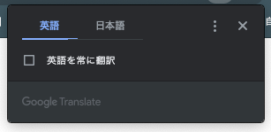
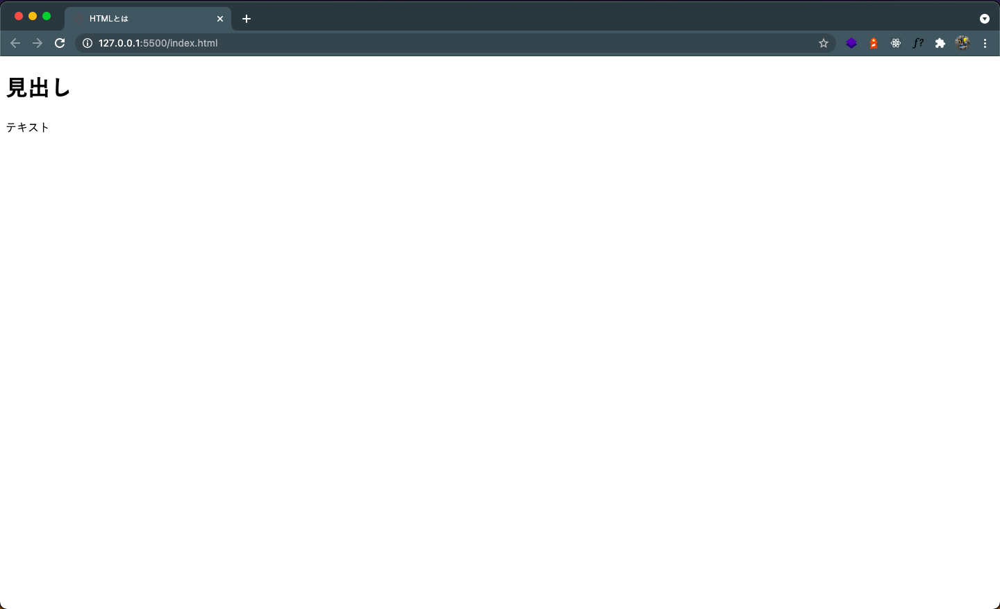

## HTML とは？

- **HTML**  
  **H**yper**T**ext **M**arkup **L**anguage の略称で HTML（エイチティーエムエル）と呼ばれています。  
  直訳すると、**文章（テキスト）をマークアップする言語**ということになります。

HTML とは、Web サイトの<mark>文章（テキスト）や構造に意味を持たせる言語</mark>です。  
普段私たちが目にしている Web サイトのほとんどは HTML で作られており、勿論この Web サイトも HTML で作られています。

例えば・・・

- ここの文字はサイトのタイトルですよ！
- ここの文字はリンクですよ！

といった形で、コンピューターが理解できるように文章を<mark>マークアップ</mark>するのが HTML の役割になります。

実際の実務でもよく使う HTML タグの中の 1 つである a タグを例に簡単に紹介します。

- a タグの使い方

```html:title=aタグを使いテキストリンクを作成する例！
<a href="https://google.com">Googleのリンク！</a>
```

- ↑ のコードの実際の表示  
   [Google のリンク！](https://google.com)
  （クリックすると Google の検索ページにジャンプします。）

これは一例に過ぎないですが、このように HTML ではただのテキストをマークアップすることで、上記のリンクテキストのように<mark>役割を持ったテキスト</mark>を作成することが簡単にできるようになります！

---

a タグについて詳しく知りたい！と思う方は以下の記事をチェックしてみてください！  
[a href とは？a タグに使用する href 属性の使い方について徹底解説！](../what-is-ahref/)

---

## HTML 基本型

この章では HTML の基本のタグとその意味について解説していきます。  
以下のコードは HTML を記述する上での必要最低限の基本型になります。

```html:title=このコードが最低限必要なHTMLの基本型
<!DOCTYPE html>
<html lang="ja">
	<head>
		<meta charset="UTF-8" />
		<title>HTMLとは</title>
	</head>
	<body>
		<h1>見出し</h1>
		<p>テキスト</p>
	</body>
</html>
```

次の章以降はこの基本となる HTML のコードをベースにして、各コードがどう言う意味や役割を持っているのか解説していきます。

## DOCTYPE 宣言

**DOCTYPE 宣言** 、又は **文書型宣言**、といいます。  
`<!DOCTYPE html>`⇦ このコード以下は HTML で作成された 文章です！  
とコンピューターに伝えるタグになります。

```html{1}
<!DOCTYPE html>
<html lang="ja">
	<head>
		<meta charset="UTF-8" />
		<title>HTMLとは</title>
	</head>
	<body>
		<h1>見出し</h1>
		<p>テキスト</p>
	</body>
</html>
```

## サイトの言語設定

`<html lang="ja">` はそのサイトで使用する言語を指定する属性になります。  
**lang="ja"** というのは日本語表記を指定していることになります。

```html{2,11}
<!DOCTYPE html>
<html lang="ja">
	<head>
		<meta charset="UTF-8" />
		<title>HTMLとは</title>
	</head>
	<body>
		<h1>見出し</h1>
		<p>テキスト</p>
	</body>
</html>
```

ちなみに、`<html lang="en">`だと英語表記を指定することになります。

```html{2}
<!DOCTYPE html>
<html lang="en">
	<head>
		<meta charset="UTF-8" />
		<title>HTMLとは</title>
	</head>
	<body>
		<h1>見出し</h1>
		<p>テキスト</p>
	</body>
</html>
```



Web サイトを閲覧した際、上記のような表示が出た経験がある方は多いのではないでしょうか。  
これはつまり、上記のように`<html lang="en">`と指定されたサイトになります。

## メタ情報の設定

この`<head></head>`で囲まれた所は、実際のブラウザには表示されない箇所になります。  
何を記述する箇所かというと、そのサイトの情報をブラウザに伝える為に記述する箇所になります。

```html{3-6}
<!DOCTYPE html>
<html lang="ja">
	<head>
		<meta charset="UTF-8" />
		<title>HTMLとは</title>
	</head>
	<body>
		<h1>見出し</h1>
		<p>テキスト</p>
	</body>
</html>
```

---

- 文字コードの指定

```html{2}
	<head>
		<meta charset="UTF-8" />
		<title>HTMLとは</title>
	</head>
```

こちらは理解しようとすると少し難しいですので、初めのうちはそういうおまじないと認識していて問題ありません。

`<meta charset="UTF-8" />` というのは、サイトを作成する上では必須で記述するタグになります。

**指定してないとどうなるの？**

指定しないとコンピューターが日本語文字を文字として認識できなく、文字化けを起こす可能性がありますので必ず記述するようにしましょう。

---

- タイトルタグの設定  
  `<title>ここに書いた文字がタイトルです</title>`

```html{3}
	<head>
		<meta charset="UTF-8" />
		<title>HTMLとは</title>
	</head>
```

上記のようにタイトルタグの中に書いた文字はブラウザで見た際、以下のようにサイトのタブに反映されます。


## サイトの表示

`<body></body>`body タグで囲まれていてその中に記述されているコードが
<mark>実際のサイトの画面内に表示される</mark>箇所になります。

```html{7-10}
<!DOCTYPE html>
<html lang="ja">
	<head>
		<meta charset="UTF-8" />
		<title>HTMLとは</title>
	</head>
	<body>
		<h1>見出し</h1>
		<p>テキスト</p>
	</body>
</html>
```

上記のコードを実際にブラウザで表示してみると以下のような画面が表示されることになります。



## まとめ

1. HTML とは文章や構造に意味を持たせる**マークアップ言語**
1. サイトによって日本語サイトなのか、英語のサイトなのかを指定できる
1. HTML の`<head></head>`で囲まれている所は実際の画面に<mark>表示されない！</mark>
1. HTML の`<body></body>`で囲まれている所は実際の画面に<mark>表示される！</mark>

## おすすめの記事

- a タグについての解説記事  
  [a href とは？a タグに使用する href 属性の使い方について徹底解説！](../what-is-ahref/)
- MDN Web Docs  
  [HTML の基本 | MDN](https://developer.mozilla.org/ja/docs/Learn/Getting_started_with_the_web/HTML_basics)
